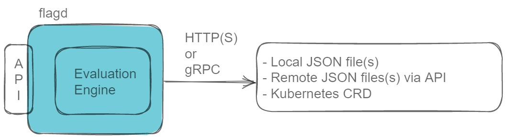

<!-- markdownlint-disable MD033 -->
<h1 align="center">
  
</h1>

<h2 align="center">A feature flag daemon with a Unix philosophy.</h4>

<p align="center">
  <a href="https://github.com/open-feature/flagd/actions">
    
  </a>
  <a href="https://goreportcard.com/report/github.com/open-feature/flagd">
    
  </a>
</a>
</p>

<h2 align="center"><a href="https://killercoda.com/open-feature/scenario/flagd-demo" target="_blank">Try flagd in the Killercoda Playground (in browser)</a></h4>
<!-- markdownlint-enable MD033 -->

## Features

Flagd is a simple command line tool for fetching and evaluating feature flags for services.

Think of it as a ready-made, open source, OpenFeature compliant feature flag backend system.

- OpenFeature compliant with providers available in many languages
- Multiple flag configuration sources including `files`, `http`, and `Kubernetes` can be used simultaneously
- Accessible over gRPC and HTTP
- Supports subscriptions to real-time flag change events
- Flexible targeting rules based on [JSON Logic](https://jsonlogic.com/)
- Lightweight daemon, with an emphasis on performance
- Native support for metrics using Prometheus

## Quick Start


*High level, logical architecture of flagd*

1. flagd can be run as a standalone-binary or container. [Download and install flagd or run it as a container](docs/usage/installation_options.md)

2. Start flagd:
```
// Start flagd
flagd start \
  --port 8013 \
  --uri https://raw.githubusercontent.com/open-feature/flagd/main/samples/example_flags.flagd.json

/* Or with docker:
  docker run \
    --rm -it \
    --name flagd \
    -p 8013:8013 \
    ghcr.io/open-feature/flagd:latest start \
    --uri https://raw.githubusercontent.com/open-feature/flagd/main/samples/example_flags.flagd.json
*/
```
`--uri` can be a local file or any remote endpoint. Use `file:` prefix for local files. eg. `--uri file:/path/to/example_flags.flagd.json`. `gRPC` and `http` have their own requirements. More information can be found [here](docs/configuration/configuration.md#uri-patterns).

Multiple `--uri` parameters can be specified. In other words, flagd can retrieve flags from multiple sources simultaneously.

3. Flagd is now ready to perform flag evaluations over either `HTTP(s)` or `gRPC`. This example utilizes `HTTP` via `cURL`.

```
// Retrieve a String flag
curl -X POST "http://localhost:8013/schema.v1.Service/ResolveString" \
  -d '{"flagKey":"myStringFlag","context":{}}' -H "Content-Type: application/json"

// Result:
{"value":"val1","reason":"DEFAULT","variant":"key1"}
```

Updates to the underlying flag store (e.g. JSON file) are reflected by flagd in realtime. No restarts required.

flagd also supports boolean, integer, float and object flag types. Read more on the [evaluation examples page](docs/usage/evaluation_examples.md)

4. Now that flagd is running, it is time to integrate into your application. Do this by using [an OpenFeature provider in a language of your choice](https://github.com/open-feature/flagd/blob/main/docs/usage/flagd_providers.md).

## Further Documentation

Further documentation including flagd configuration options, fractional evaluation, targeting rules and flag configuration merging strategies can be found [on this page](docs/README.md).

## Contributing

See [CONTRIBUTING.md](CONTRIBUTING.md) for details on how to contribute to the OpenFeature project.

Our community meetings are held regularly and open to everyone.
Check the [OpenFeature community calendar](https://calendar.google.com/calendar/u/0?cid=MHVhN2kxaGl2NWRoMThiMjd0b2FoNjM2NDRAZ3JvdXAuY2FsZW5kYXIuZ29vZ2xlLmNvbQ) for specific dates and for the Zoom meeting links.

Thanks so much to our contributors.

<!-- markdownlint-disable MD033 -->
<a href="https://github.com/open-feature/flagd/graphs/contributors">
  
</a>
<!-- markdownlint-enable MD033 -->

Made with [contrib.rocks](https://contrib.rocks).

## License

Apache License 2.0
