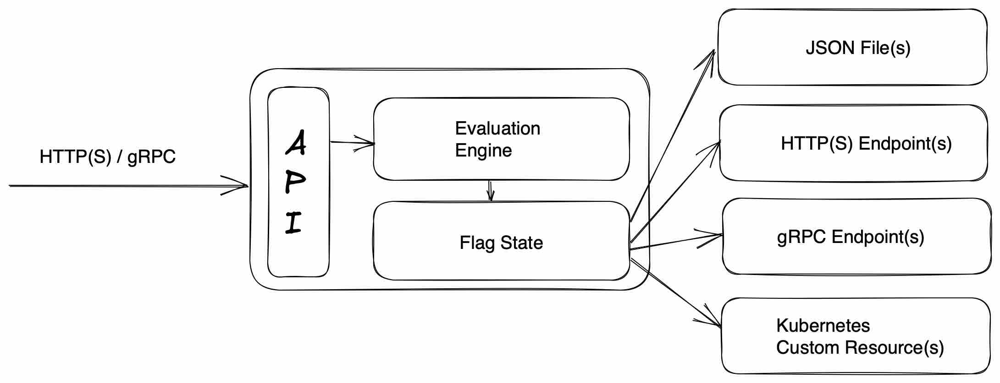

<!-- markdownlint-disable MD033 -->
<h1 align="center">
  
</h1>

<h2 align="center">A feature flag daemon with a Unix philosophy.</h2>

<p align="center">
  <a href="https://github.com/open-feature/flagd/actions">
    
  </a>
  <a href="https://goreportcard.com/report/github.com/open-feature/flagd">
    
  </a>
  <a href="https://killercoda.com/open-feature/scenario/flagd-demo">
    
  </a>
</p>

<!-- markdownlint-enable MD033 -->

## What's flagd?

Flagd is a feature flag daemon with a Unix philosophy. Think of it as a ready-made, open source, OpenFeature compliant feature flag backend system.

## Features

- 🌐 OpenFeature compliant and [speaks your language](docs/usage/flagd_providers.md).
- 🆕 Easy to [extend to new languages](docs/other_resources/creating_providers.md).
- 🔄 Supports multiple data sources simultaneously.
- 🕒 Feature Flag updates occur in near real-time.
- 💪 Contains a [powerful and flexible rule targeting engine](docs/configuration/reusable_targeting_rules.md) and [deterministic percentage-based rollouts](docs/configuration/fractional_evaluation.md).
- 🔦 Flag evaluation statistics and metrics are exposed and compatible with Prometheus.

## ▶️ Quick Start

Experiment with flagd in your browser using [the Killercoda tutorial](https://killercoda.com/open-feature/scenario/flagd-demo) or follow the instructions below to run on your own infrastructure.

1. flagd can be run as a standalone-binary or container. [Download and install flagd or run it as a container](docs/usage/installation_options.md)

   Kubernetes-native? flagd can also be run [as part of the Kubernetes Operator](https://github.com/open-feature/open-feature-operator).

2. Start flagd:

    ```sh
    flagd start \
      --port 8013 \
      --uri https://raw.githubusercontent.com/open-feature/flagd/main/samples/example_flags.flagd.json
    ```

    Or use docker:
   (this flagd on docker command will not work on Windows due to the mixed filesystems [#8479](https://github.com/docker/for-win/issues/8479)!! See also [this medium article](https://levelup.gitconnected.com/docker-desktop-on-wsl2-the-problem-with-mixing-file-systems-a8b5dcd79b22) )

    ```sh
    docker run \
      --rm -it \
      --name flagd \
      -p 8013:8013 \
      ghcr.io/open-feature/flagd:latest start \
      --uri https://raw.githubusercontent.com/open-feature/flagd/main/samples/example_flags.flagd.json
    ```

    If you wish, download the file locally to make changes:

    ```sh
    wget https://raw.githubusercontent.com/open-feature/flagd/main/samples/example_flags.flagd.json
    ```

    In local mode, run flagd like this:

    ```sh
    flagd start \
      --port 8013 \
      --uri file:./example_flags.flagd.json
    ```

    Or use docker (!!this does not work on Windows!!):

    ```sh
    docker run \
      --rm -it \
      --name flagd \
      -p 8013:8013 \
      -v $(pwd):/etc/flagd \
      ghcr.io/open-feature/flagd:latest start \
      --uri file:./etc/flagd/example_flags.flagd.json
    ```

    `--uri` can be a local file or any remote endpoint. Use `file:` prefix for local files. eg. `--uri file:/path/to/example_flags.flagd.json`. `gRPC` and `http` have their own requirements. More information can be found [here](docs/configuration/configuration.md#uri-patterns).

    Multiple `--uri` parameters can be specified. In other words, flagd can retrieve flags from multiple sources simultaneously.

3. Flagd is now ready to perform flag evaluations over either `HTTP(s)` or `gRPC`. This example utilizes `HTTP` via `cURL`.

    Retrieve a `String` value:

    ```sh
    curl -X POST "http://localhost:8013/schema.v1.Service/ResolveString" \
      -d '{"flagKey":"myStringFlag","context":{}}' -H "Content-Type: application/json"
    ```

   For Windows we recommend using a [WSL](https://learn.microsoft.com/en-us/windows/wsl/install) terminal.
   Otherwise, use the following with `cmd`:

    ```sh
    set json={"flagKey":"myStringFlag","context":{}}
    curl -i -X POST -H "Content-Type: application/json" -d %json:"=\"% "localhost:8013/schema.v1.Service/ResolveString"
    ```

    Result:

    ```json
    {
      "value": "val1",
      "reason": "DEFAULT",
      "variant":"key1"
    }
    ```

    Updates to the underlying flag store (e.g. JSON file) are reflected by flagd in realtime. No restarts required.

    flagd also supports boolean, integer, float and object flag types. Read more on the [evaluation examples page](docs/usage/evaluation_examples.md)

4. Now that flagd is running, it is time to integrate into your application. Do this by using [an OpenFeature provider in a language of your choice](https://github.com/open-feature/flagd/blob/main/docs/usage/flagd_providers.md).

## 📐 High-level Architecture



## 📝 Further Documentation

Further documentation including flagd configuration options, fractional evaluation, targeting rules and flag configuration merging strategies can be found [on this page](docs/README.md).

## 🫶 Contributing

Interested in contributing? Great, we'd love your help! To get started, take a look at the [CONTRIBUTING](CONTRIBUTING.md) guide.

We also hold regular community meetings that are open to everyone.
Check the [OpenFeature community page](https://openfeature.dev/community/) for all the ways to get involved.

Thanks so much to our contributors.

<!-- markdownlint-disable MD033 -->
<a href="https://github.com/open-feature/flagd/graphs/contributors">
  
</a>
<!-- markdownlint-enable MD033 -->

Made with [contrib.rocks](https://contrib.rocks).

## License

[Apache License 2.0](LICENSE)
