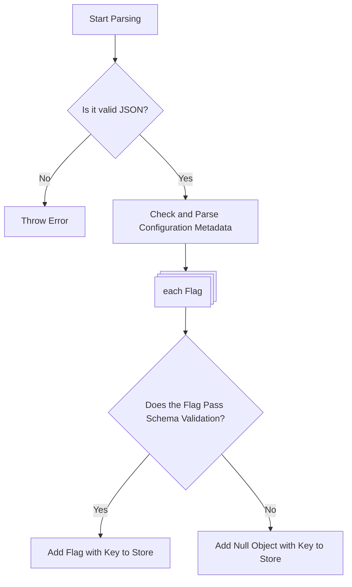
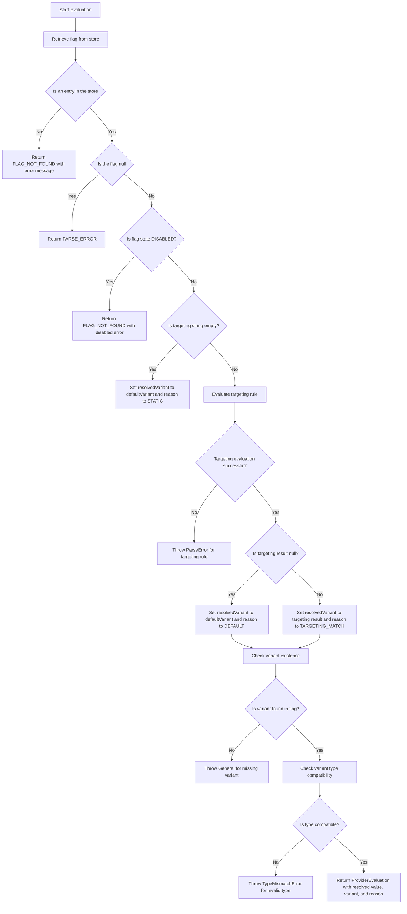

# Proposal for Unified Flag Parsing and Handling

The goal of this proposal is to standardize how flags are parsed and handled across implementations. Currently, there is significant variation in how this is done, stemming from the organic growth of the project and contributions from multiple developers. This proposal aims to rethink and unify the parsing and handling of configurations, particularly for in-process scenarios.

## Background

Initially we did not have a JSON schema, and validation was done manually after the configuration was parsed; in this case parsing was not consistent at all.
These inconsistencies have resulted in bugs, unexpected behaviors, and challenges in maintaining the codebase.
For example, the file provider and JSON parsing behave differently across languages, and there is no clear definition of what constitutes a parsing error versus a flag-not-found error.

Several issues have been raised that highlight the need for a unified approach:

- [BUG] Inconsistency in file provider and JSON parsing for different languages (#1627)
- [BUG] [File Provider] Support File Formats (#1689)
- [FEATURE] Provider option to reject flag set with invalid rules (#1487)

To address these issues, it is essential to establish a consistent and testable framework for flag parsing and handling.

## Requirements

- Utilize schema validation as much as possible, instead of custom logic, on a flag level rather than a configuration level.
- Define what constitutes a `PARSE_ERROR` versus what prevents the flag set from being updated.
- Define if an invalid flag entry within a configuration can invalidate the whole configuration.
- Define which file formats are supported (e.g., JSON, YAML, etc.).
- Ensure the framework is testable via the existing testbed/test-harness.

## Considered Options

- Standardize flag parsing and handling using schema validation ([Option 1](#option-1-standardize-flag-parsing-and-handling-using-schema-validation).
- Continue with the current approach but document the inconsistencies (Option 2).
- Develop separate parsing logic for each implementation to address specific needs (Option 3).
- Be rigid and enforce the JSON Schema Validation for all updates, even if that means ignoring updates if just one flag is violating the schema ([Option 4](#option-4-full-document-validation-on-sync)).

## Proposal

### Option 1: Standardize Flag Parsing and Handling Using Schema Validation

This proposal recommends adopting schema validation as the primary method for parsing and handling flags. The key elements of this approach include:

1. **Schema Validation**: Use schema validation to ensure that flags meet predefined criteria. This reduces the reliance on custom logic and improves consistency across implementations.
2. **Supported File Formats**: Define and document the file formats that are supported (e.g., JSON, YAML). This aligns with the issue raised in [BUG] [File Provider] Support File Formats (#1689).
3. **Error Definitions**: Clearly define what constitutes a `PARSE_ERROR` versus a `FLAG_NOT_FOUND` error. Each inconsistent flag should evaluate as a `PARSE_ERROR`, only if the flag is not part of the configuration (or due to other definitions), it should evaluate to a `FLAG_NOT_FOUND`
4. **Invalid Flag Handling**: A invalid flag configuration should not affect the whole configuration. Other valid flags might still be important, and an error on one flag should not hinder updates or changes to the flag configuration.
5. **Testability**: Design the framework to be testable using the existing testbed/test-harness. This ensures that the implementation is robust and meets the defined requirements.

#### Parsing Flow

#### Resolution flow

> [!NOTE]
> This was generated with AI and enhanced based on the java flagd provider

#### API Changes

No immediate API changes are proposed. However, the internal logic for flag parsing and handling will be standardized, which may indirectly impact APIs that rely on these processes.

#### Consequences Option 1

- **Positive Consequences**:
    - Improved consistency across implementations.
    - Easier maintenance and debugging.
    - Enhanced testability and reliability.
    - Robustness of Configuration issues (one invalid flag can not stop and update of others)
- **Negative Consequences**:
    - Initial development effort to implement the unified framework.
    - Potential learning curve for contributors to adapt to the new framework.

### Option 4: Full Document Validation on Sync

#### Summary

This alternative proposal suggests validating the entire flags configuration document using the schema provided at [https://flagd.dev/schema/v0/flags.json](https://flagd.dev/schema/v0/flags.json). The validation would occur both at startup and during each sync update.

#### Key Elements

1. **Validation at Startup**:

- If any part of the configuration is invalid, the application fails to start.
- This aligns with the current behavior, where failure to parse the flags configuration prevents startup.

1. **Validation on Sync Updates**:

- If any part of the updated configuration is invalid, the update is ignored.
- An error or warning message is logged prominently to alert the user.
- This builds on the existing behavior, where unparseable configurations are rejected.

#### Consequences Option 4

- **Positive Consequences**:
    - Ease of Implementation: The validation step can be added to the existing parsing logic with minimal changes.
    - Simplified Testing: Many error-edge cases in the test suite can be removed, as invalid configurations will never be allowed.
    - Schema-Driven Validation: Relying on the schema eliminates the need for detailed error-handling logic.

- **Negative Consequences**:
    - Blocking Updates Due to Errors: A single invalid flag will prevent the entire update from being applied.
    - However, this is consistent with the current behavior, where unparseable flags already block updates.

### Timeline

### Open Questions

- Are there any edge cases that need to be addressed in the schema validation rules?
- Should and error in the global metadata cause and issue with the parsing?
- What solution do we prefer?

## More Information

For additional context, refer to the following issues:

- [BUG] Inconsistency in file provider and JSON parsing for different languages (#1627)
- [BUG] [File Provider] Support File Formats (#1689)
- [FEATURE] Provider option to reject flag set with invalid rules (#1487)
