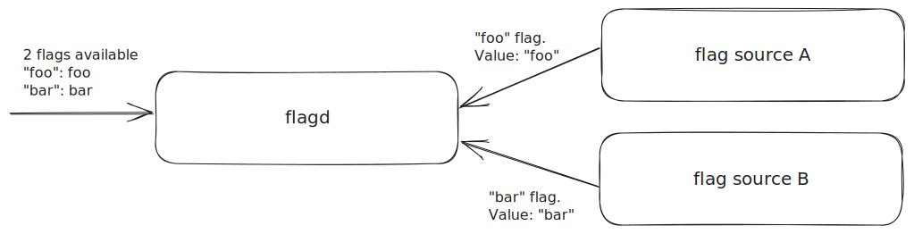
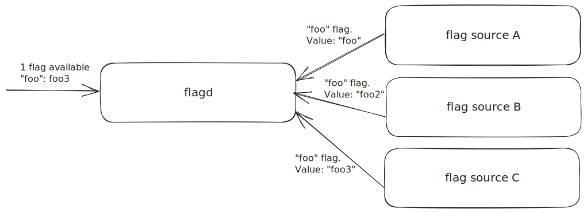
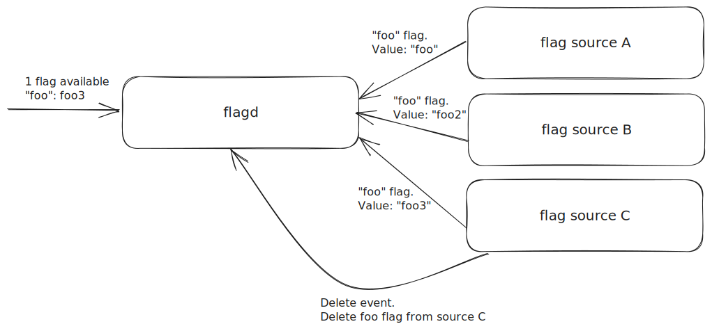
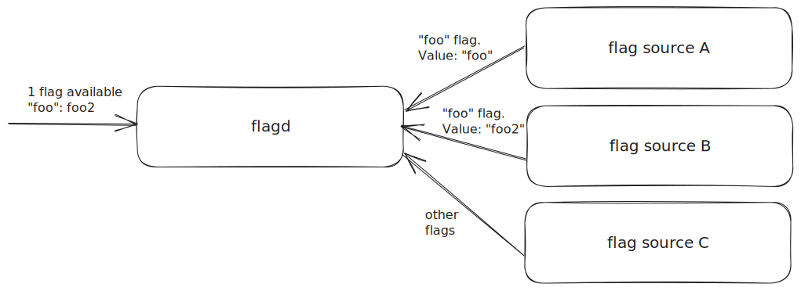

# Syncs

Syncs are a core part of flagd; they are the abstraction that enables different sources for feature flag definitions.
flagd can connect to one or more sync sources.

## Available syncs

### Filepath sync

The file path sync provider reads and watch the source file for updates(ex: changes and deletions).
It's important to note that most file operations result in multiple file system events.
For production use-cases, a symbolic link is recommended for the watched file, which enables atomic modification.
See the [relevant troubleshooting entry](../troubleshooting.md#extra-duplicate-events-in-file-syncs).

```shell
flagd start --uri file:etc/featureflags.json
```

In this example, `etc/featureflags.json` is a valid feature flag definition file accessible by the flagd process.
See [sync source](../reference/sync-configuration.md#source-configuration) configuration for details.

---

### HTTP sync

The HTTP sync provider fetch flags from a remote source and periodically poll the source for flag definition updates.

```shell
flagd start --uri https://my-flag-source/flags.json
```

In this example, `https://my-flag-source/flags.json` is a remote endpoint responding valid feature flag definition when
invoked with **HTTP GET** request.
The polling interval, port, TLS settings, and authentication information can be configured.
See [sync source](../reference/sync-configuration.md#source-configuration) configuration for details.

To optimize network usage, it honors the HTTP ETag protocol: if the server includes an `ETag` header in its response,
flagd will store this value and send it in the `If-None-Match` header on subsequent requests. If the flag data has
not changed, the server responds with 304 Not Modified, and flagd will skip updating its state. If the data has
changed, the server returns the new content and a new ETag, prompting flagd to update its flags.

---

### gRPC sync

The gRPC sync provider streams flag definitions from a gRPC sync provider implementation.
This stream connection is defined by the [sync service protobuf definition](https://github.com/open-feature/flagd-schemas/blob/main/protobuf/flagd/sync/v1/sync.proto).

```shell
flagd start --uri grpc://grpc-sync-source
```

In this example, `grpc-sync-source` is a grpc target implementing [sync.proto](../reference/specifications/protos.md#syncv1sync_serviceproto) definition.
See [sync source](../reference/sync-configuration.md#source-configuration) configuration for details.

---

### Kubernetes sync

The Kubernetes sync provider allows flagd to connect to a Kubernetes cluster and evaluate flags against a specified
FeatureFlag resource as defined within
the [open-feature-operator](https://github.com/open-feature/open-feature-operator/blob/main/apis/core/v1beta1/featureflag_types.go)
spec.
This configuration is best used in conjunction with the [OpenFeature Operator](https://github.com/open-feature/open-feature-operator).

To use an existing FeatureFlag custom resource, start flagd with the following command:

```shell
flagd start --uri core.openfeature.dev/default/my_example
```

In this example, `default/my_example` expected to be a valid FeatureFlag resource, where `default` is the
namespace and `my_example` being the resource name.
See [sync source](../reference/sync-configuration.md#source-configuration) configuration for details.

---

### GCS sync

The GCS sync provider fetches flags from a GCS blob and periodically polls the GCS for the flag definition updates.
It uses [application default credentials](https://cloud.google.com/docs/authentication/application-default-credentials) if they
are [configured](https://cloud.google.com/docs/authentication/provide-credentials-adc) to authorize the calls to GCS.

```shell
flagd start --uri gs://my-bucket/my-flags.json
```

In this example, `gs://my-bucket/my-flags.json` is expected to be a valid GCS URI accessible by the flagd
(either by being public or together with application default credentials).
The polling interval can be configured.
See [sync source](../reference/sync-configuration.md#source-configuration) configuration for details.

### Azure Blob sync

The Azure Blob sync provider fetches flags from an Azure Blob Storage blob and periodically polls the blob for the flag definition updates.
It uses [environment variables](https://pkg.go.dev/gocloud.dev/blob/azureblob#hdr-URLs) to set the Storage Account name and to
authorize the calls to Azure Blob Storage.

```shell
flagd start --uri azblob://my-container/my-flags.json
```

In this example, assuming the environment variable AZURE_STORAGE_ACCOUNT is set to `myaccount`, and other options are not set, the service URL will be:
`https://myaccount.blob.core.windows.net/my-container/my-flags.json`.
This is expected to be a valid service URL accessible by flagd (either by being public or together with environment variable credentials).
The polling interval can be configured.
See [sync source](../reference/sync-configuration.md#source-configuration) configuration for details.

### S3 sync

The S3 sync provider fetches flags from an S3 bucket and periodically polls for flag definition updates.
It uses [AWS standardized credentials chain](https://docs.aws.amazon.com/sdkref/latest/guide/standardized-credentials.html) to authorize the calls to AWS.

```shell
flagd start --uri s3://my-bucket/my-flags.json
```

In this example, `s3://my-bucket/my-flags.json` is expected to be a valid URI accessible by flagd
(either by being public or together with the appropriate credentials read from a file or via the environment as described in the AWS docs linked above).
The polling interval is configurable.
See [sync source](../reference/sync-configuration.md#source-configuration) for details.

## Merging

Flagd can be configured to read from multiple sources at once, when this is the case flagd will merge all flag definition into a single
merged state.

For example:



In this example, `source-A` and `source-B` provide a single flag definition, the `foo` flag and the `bar` flag respectively.
The merge logic for this definition is simple, both flag definition are added to the `store`.

In most scenarios, these flag sources will be supplying `n` number of definition, using a unique flag key for each definition.

However, as multiple sources are being used, there is the opportunity for keys to be duplicated, intentionally or not, between flag sources.
In these situations `flagd` uses a merge priority order to ensure that its behavior is consistent.

Merge order is dictated by the order that `sync-providers` and `uris` are defined, with the latest defined source taking precedence over those defined before it, as an example:

```sh
./bin/flagd start --uri file:source-A.json --uri file:source-B.json --uri file:source-C.json
```

When `flagd` is started with the command defined above, `source-B` takes priority over `source-A`, whilst `source-C` takes priority over both `source-B` and `source-A`.

Using the above example, if a flag key is duplicated across all 3 sources, then the definition from `source-C` would be the only one stored in the merged state.



### State Resync Events

Given the above example, the `source-A` and `source-B` 'versions' of flag definition the `foo` have been discarded, so if a delete event in `source-C` results in the removal of the `foo`flag, there will no longer be any reference of `foo` in flagd's store.

As a result of this flagd will return `FLAG_NOT_FOUND` errors, and the OpenFeature SDK will always return the default value.

To prevent flagd falling out of sync with its flag sources during delete events, resync events are used.
When a delete event results in a flag definition being removed from the merged state, the full set of definition is requested from all flag sources, and the merged state is rebuilt.
As a result, the value of the `foo` flag from `source-B` will be stored in the merged state, preventing flagd from returning `FLAG_NOT_FOUND` errors.



In the example above, a delete event results in a resync event being fired, as `source-C` has deleted its 'version' of the `foo`, this results in a new merge state being formed from the remaining definition.



Resync events may lead to further resync events if the returned flag definition result in further delete events, however the state will eventually be resolved correctly.
