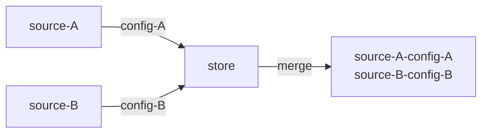
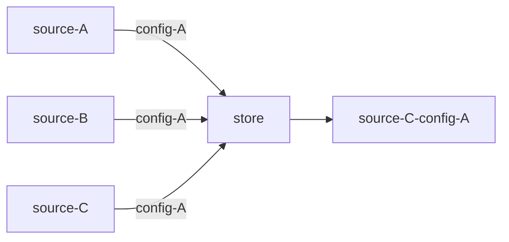
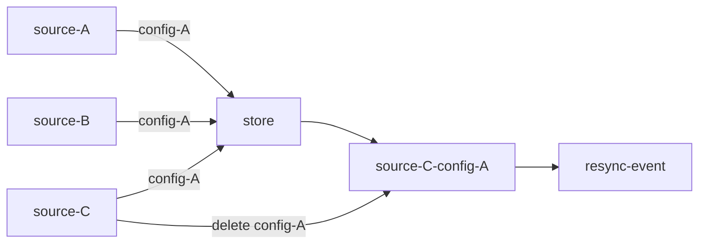
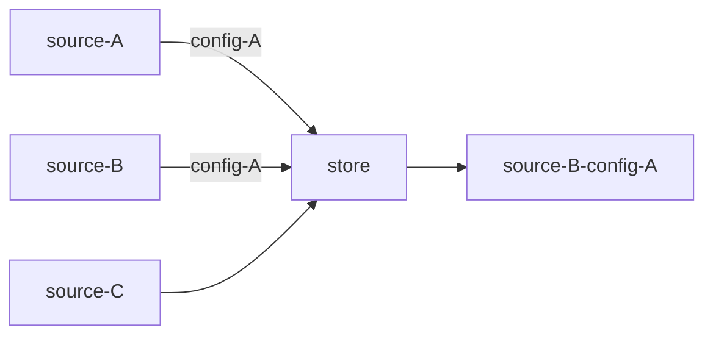

# Flag Configuration Merging

Flagd can be configured to read from from multiple sources at once, when this is the case flagd will merge all flag configurations into a single 
merged state. For example:



In this example `source-A` and `source-B` are providing a single flag configuration, `config-A` and `config-B` respectively. The merge logic for this configuration is simple, and both flag configurations are added to the `store`.
In most scenarios these flag sources will be supplying `n` number of configurations, using a unique flag key for each configuration. However, as multiple sources are being used, there is the opportunity for keys to be duplicated, intentionally or not, between flag sources. In these situations `flagd` uses a merge priority order to ensure that its behavior is consistent.

Merge order is dictated by the order that `sync-providers` and `uris` are defined, with the latest defined source taking precedence over those defined before it, as an example:

```sh
./flagd start --uri file:source-A.json --uri file:source-B.json --uri file:source-C.json
```

When `flagd` is started with the command defined above, `source-B` takes priority over `source-A`, whilst `source-C` takes priority over both `source-B` and `source-A`. Using the above example, if a flag key is duplicated across all 3 sources, then the configuration from `source-C` would be the only one stored in the merged state.



## State Resync Events

Given the above example, the `source-A` and `source-B` 'versions' of flag configuration `config-A` have been discarded, so if a delete event in `source-C` results in the removal of `config-A`, there will no longer be any reference of` config-A` in flagd's store. As a result of this flagd will return `FLAG_NOT_FOUND` errors, and the OpenFeature SDK will always return the default value.

To prevent flagd falling out of sync with its flag sources during delete events resync events are used. When a delete event results in a flag configuration being removed from the merged state, the full set of configurations is requested from all flag sources, and the merged state is rebuilt. As a result the value of `config-A` from `source-B` will be stored in the merged state, preventing flagd from returning `FLAG_NOT_FOUND` errors.


In the example above a delete event is results in a resync event being fired, as `source-C` has deleted its 'version' of `config-A`, this results in a new merge state being formed from the remaining configurations.



Resync events may lead to further resync events if the returned flag configurations result in further delete events, however the state will eventually be resolved correctly.