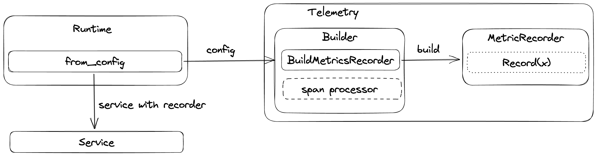

# Telemetry

<!-- TOC -->
* [Telemetry](#telemetry)
  * [Export to OTEL collector](#export-to-otel-collector)
    * [Configure local collector setup](#configure-local-collector-setup)
      * [docker-compose.yaml](#docker-composeyaml)
      * [otel-collector-config.yaml](#otel-collector-configyaml)
      * [prometheus.yml](#prometheusyml)
<!-- TOC -->

flagd provides telemetry data out of the box. These telemetry data is compatible with OpenTelemetry.

By default, Prometheus exporter is used for metrics and metrics can be accessed from `/metrics` endpoint. For example,
with default startup flags, metrics are exposed at `http://localhost:8014/metrics`.

Given below is the current implementation overview of flagd telemetry internals,



## Export to OTEL collector

flagd can be configured to connect to [OTEL collector](https://opentelemetry.io/docs/collector/). This requires startup
flag `metrics-exporter` to be `otel` and a valid `otel-collector-uri`. For example,

`flagd start --uri file:/flags.json --metrics-exporter otel --otel-collector-uri localhost:4317`

### Configure local collector setup

To configure a local collector setup along with Jaeger and Prometheus, you can use following sample docker-compose
file and configuration files.

Note - content is adopted from
official [OTEL collector example](https://github.com/open-telemetry/opentelemetry-collector-contrib/tree/main/examples/demo)

#### docker-compose.yaml

```yaml
version: "3"
services:
  # Jaeger
  jaeger-all-in-one:
    image: jaegertracing/all-in-one:latest
    restart: always
    ports:
      - "16686:16686"
      - "14268"
      - "14250"
  # Collector
  otel-collector:
    image: otel/opentelemetry-collector:latest
    restart: always
    command: [ "--config=/etc/otel-collector-config.yaml" ]
    volumes:
      - ./otel-collector-config.yaml:/etc/otel-collector-config.yaml
    ports:
      - "1888:1888"   # pprof extension
      - "8888:8888"   # Prometheus metrics exposed by the collector
      - "8889:8889"   # Prometheus exporter metrics
      - "13133:13133" # health_check extension
      - "4317:4317"   # OTLP gRPC receiver
      - "55679:55679" # zpages extension
    depends_on:
      - jaeger-all-in-one
  prometheus:
    container_name: prometheus
    image: prom/prometheus:latest
    restart: always
    volumes:
      - ./prometheus.yaml:/etc/prometheus/prometheus.yml
    ports:
      - "9090:9090"
```

#### otel-collector-config.yaml

```yaml
receivers:
  otlp:
    protocols:
      grpc:
exporters:
  prometheus:
    endpoint: "localhost:8889"
    const_labels:
      label1: value1
  jaeger:
    endpoint: jaeger-all-in-one:14250
    tls:
      insecure: true
processors:
  batch:
service:
  pipelines:
    traces:
      receivers: [ otlp ]
      processors: [ batch ]
      exporters: [ jaeger ]
    metrics:
      receivers: [ otlp ]
      processors: [ batch ]
      exporters: [ prometheus ]
```

#### prometheus.yml

```yaml
scrape_configs:
  - job_name: 'otel-collector'
    scrape_interval: 10s
    static_configs:
      - targets: [ 'otel-collector:8889' ]
      - targets: [ 'otel-collector:8888' ]
```

Once, configuration files are ready, use `docker-compose up` to start the local setup. With successful startup, you can
access metrics through [Prometheus](http://localhost:9090/graph) & traces through [Jaeger](http://localhost:16686/).
