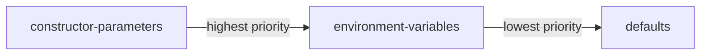

# Creating a flagd provider

The provider is responsible for creating an abstraction between `flagd` and the OpenFeature SDK (for the [chosen technology](https://docs.openfeature.dev/docs/reference/technologies/)).

Prerequisites:

- Understanding of [general provider concepts](https://docs.openfeature.dev/docs/reference/concepts/provider/)
- Proficiency in the chosen programming language (check the language isn't already covered by the [existing providers](../usage/flagd_providers.md))

Communication with `flagd` is possible via Protobuf or REST.
Protobuf is the recommended approach (as such, that is the approach outlined in this document) when possible (not possible if no tooling exists for a given technology).

## Protobuf

Protobuf schemas define the contract between a client (provider) and server (`flagd`). `flagd`'s schemas are defined [here](https://github.com/open-feature/schemas/tree/main/protobuf).

### Code generation

Leverage the [buf CLI](https://docs.buf.build/installation) to generate a `flagd` client in the chosen technology:

Add the [open-feature schema repository](https://github.com/open-feature/schemas) as a submodule

```shell
git submodule add --force https://github.com/open-feature/schemas.git
```

Create a `buf.gen.{chosen language}.yaml` for the chosen language in `schemas/protobuf` (if it doesn't already exist) using one of the other files as a template (find a plugin for the chosen language [here](https://buf.build/protocolbuffers/plugins)) and create a pull request with this file.

Generate the code (this step ought to be automated in the build process for the chosen technology so that the generated code is never committed)

```shell
cd schemas/protobuf
buf generate --template buf.gen.{chosen language}.yaml
```

Move the generated code (following convention for the chosen language) and add its location to .gitignore

## Provider construction

(__using Go as an example__)

Create a provider struct/class/type (whichever is relevant to the chosen language) with an exported (public) constructor allowing configuration (e.g. `flagd` host).
Give the provider an unexported (private) client field, set this field as the client generated by the previous step.

Create methods for the provider to satisfy the chosen language SDK's provider interface.
These methods ought to wrap the built client's methods.

```go
type Provider struct {
    client generated.Client
    flagdHost string
}

type ProviderOption func(*Provider)

func NewProvider(options ...ProviderOption) *Provider {
    provider := &Provider{}
    for _, opt := range opts {
        opt(provider)
    }
 
    provider.client: generated.NewClient(provider.flagdHost),
 
    return provider
}

func WithHost(host string) ProviderOption {
    return func(p *Provider) {
        p.flagdHost = host
    }
}

func (p *Provider) BooleanEvaluation(
    ctx context.Context, flagKey string, defaultValue bool, evalCtx of.FlattenedContext,
) of.BoolResolutionDetail {
    res, err := p.client.ResolveBoolean(ctx, connect.NewRequest(&schemaV1.ResolveBooleanRequest{
        FlagKey: flagKey,
        // omitted Context for simplicity, see Go's provider for completeness
    }))
    if err != nil {
        return of.BoolResolutionDetail{
            Value: defaultValue,
            ProviderResolutionDetail: of.ProviderResolutionDetail{
                ResolutionError: of.NewGeneralResolutionError(err.Error()),
                Reason:          of.Reason(res.Reason),
                Variant:         res.Variant,
            },
        }
    }

    return of.BoolResolutionDetail{
        Value: defaultValue,
        ProviderResolutionDetail: of.ProviderResolutionDetail{
            Reason:          of.Reason(res.Reason),
            Variant:         res.Variant,
        },
    }
}

// ...
```

## Caching

Follow the guidance [here](./caching.md) to implement caching.

## Configuration

Expose means to configure the provider aligned with the following priority system (highest to lowest).



### Explicit declaration

This takes the form of parameters to the provider's constructor, it has the highest priority.

### Environment variables

Read environment variables with sensible defaults (before applying the values explicitly declared to the constructor).

| Option name           | Environment variable name      | Type      | Options      | Default                                |
|-----------------------|--------------------------------|-----------|--------------|----------------------------------------|
| host                  | FLAGD_HOST                     | string    |              | localhost                              |
| port                  | FLAGD_PORT                     | number    |              | 8013                                   |
| tls                   | FLAGD_TLS                      | boolean   |              | false                                  |
| socketPath            | FLAGD_SOCKET_PATH              | string    |              |                                        |
| certPath              | FLAGD_SERVER_CERT_PATH         | string    |              |                                        |
| cache                 | FLAGD_CACHE                    | string    | lru,disabled | lru (if possible in chosen technology) |
| maxCacheSize          | FLAGD_MAX_CACHE_SIZE           | int       |              | 1000                                   |
| maxEventStreamRetries | FLAGD_MAX_EVENT_STREAM_RETRIES | int       |              | 5                                      |

## Error handling

Handle flag evaluation errors by using the error constructors exported by the SDK (e.g. `openfeature.NewProviderNotReadyResolutionError(ConnectionError)`), thereby allowing the SDK to parse and handle the error appropriately.

## Post creation

The following steps will extend the reach of the newly created provider to other developers of the chosen technology.

### Add to flagd's list of providers

Create a pull request appending the provider to the list [here](../usage/flagd_providers.md).

### Open an issue to document the provider

Create an issue in docs.openfeature.dev [here](https://github.com/open-feature/docs.openfeature.dev/issues/new?assignees=&labels=provider&template=document-provider.yaml&title=%5BProvider%5D%3A+).
This will ensure the provider is added to OpenFeature's website.
