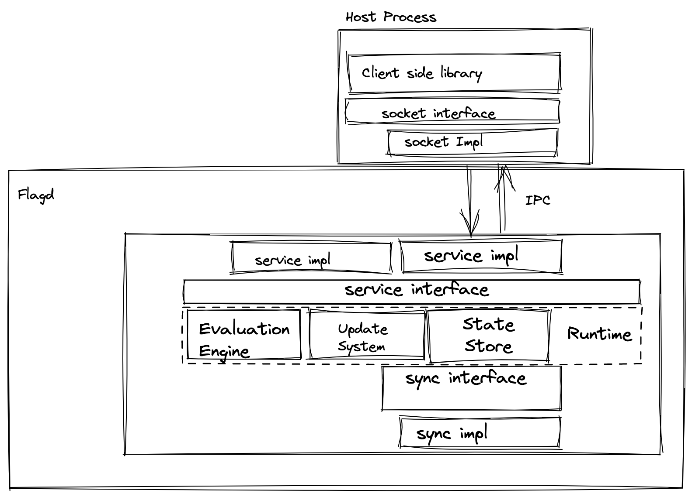
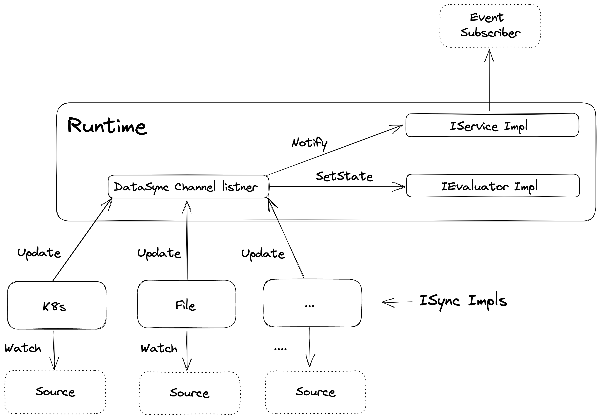

# High level architecture

## Component overview

Flagd consists of four main components - Service, Evaluator engine, Runtime and Sync.

The service component exposes the evaluator engine for client libraries. It further exposes an interface
for flag configuration change notifications.

The sync component has implementations to update flag configurations from various sources. The current implementation
contain sync providers for files, K8s resources and HTTP endpoints.

The evaluation engine's role is twofold, it acts as an intermediary between configuration changes and the state store by interpreting change events and forwarding the necessary changes to the state store. It also performs the feature flag evaluations based on evaluation requests coming from feature flag libraries.

The Runtime stays in between these components and coordinates operations.

## Sync component

The Sync component contains implementations of the ISync interface. The interface contract simply allows updating 
flag configurations watched by the respective implementation. For example, the file sync provider watches for a change 
(ex: - add, modify, remove) of a specific file in the file system.

The update provided by sync implementation is pushed to the evaluator engine, which interprets the event and forwards it to the state store. Change notifications generated in the 
process gets pushed to event subscribers.

