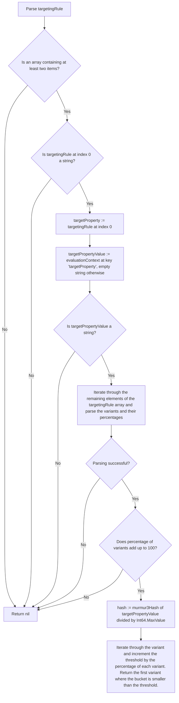

# Fractional Evaluatior

This evaluator allows to split the returned variants of a feature flag into different buckets,
where each bucket can be assigned a percentage, representing how many requests will resolve to the corresponding
variant. The sum of all weights must be 100, and the distribution must be performed by using the value of a referenced
from the evaluation context to hash that value and map it to a value between [0, 100]. It is important to note
that evaluations MUST be sticky, meaning that flag resolution requests containing the same value for the
referenced property in their context MUST always resolve to the same variant. For calculating the hash value of the
referenced evaluation context property, the [MurmurHash3](https://github.com/aappleby/smhasher/blob/master/src/MurmurHash3.cpp)
hash function should be used. This is to ensure that flag resolution requests yield the same result,
regardless of which implementation of the in-process flagd provider is being used.

The implementation of this evaluator should accept the object containing the `fractionalEvaluation` evaluator
configuration, and a `data` object containing the evaluation context. The evaluator configuration should be an
array containing at least two items, with the first item being a `string`
value representing the target property to base the distribution of values on, and the remaining items
being `arrays` with two values, with the first being `string` item representing the name of the variant, and the
second being a `float` item representing the percentage for that variant. The percentages of all items must add up to
100.0, otherwise unexpected behavior can occur during the evaluation. The `data` object can be an arbitrary
JSON object. Below is an example for a targetingRule containing a `fractionalEvaluation`:

```json
{
  "flags": {
    "headerColor": {
      "variants": {
        "red": "#FF0000",
        "blue": "#0000FF",
        "green": "#00FF00"
      },
      "defaultVariant": "red",
      "state": "ENABLED",
      "targeting": {
        "fractionalEvaluation": [
          "email",
          [
            "red",
            50
          ],
          [
            "blue",
            20
          ],
          [
            "green",
            30
          ]
        ]
      }
    }
  }
}
```

The following flow chart depicts the logic of this evaluator:



As a reference, below is a simplified version of the actual implementation of this evaluator in Go.

```go

type fractionalEvaluationDistribution struct {
    variant    string
    percentage int
}

/*
    values: contains the targeting rule object; e.g.:
        [
          "email",
          [
            "red",
            50
          ],
          [
            "blue",
            20
          ],
          [
            "green",
            30
          ]
        ]
    
    data: contains the evaluation context; e.g.:
        {
            "email": "test@faas.com"
        }
*/ 
func FractionalEvaluation(values, data interface{}) interface{} {
    // 1. Check if the values object contains at least two elements:
    valuesArray, ok := values.([]interface{})
    if !ok {
        log.Error("fractional evaluation data is not an array")
        return nil
    }
    if len(valuesArray) < 2 {
        log.Error("fractional evaluation data has length under 2")
        return nil
    }

    // 2. Get the target property used for bucketing the values and retrieve its value from the evaluation context:
    bucketBy, ok := valuesArray[0].(string)
    if !ok {
        log.Error("first element of fractional evaluation data isn't of type string")
        return nil
    }

    dataMap, ok := data.(map[string]interface{})
    if !ok {
        log.Error("data isn't of type map[string]interface{}")
        return nil
    }

    v, ok := dataMap[bucketBy]
    if !ok {
        // if the target property is not part of the evaluation context, use an empty string for calculating the hash
        v = ""
    }

    valueToDistribute, ok := v.(string)
    if !ok {
        // the target property must have a string value
        log.Error("var: %s isn't of type string", bucketBy)
        return nil
    }

    // 3. Parse the fractionalEvaluation values distribution
    sumOfPercentages := 0
    var feDistributions []fractionalEvaluationDistribution

    // start at index 1, as the first item of the values array is the target property
    for i := 1; i < len(valuesArray); i++ {
        distributionArray, ok := values[i].([]interface{})
        if !ok {
            log.Error("distribution elements aren't of type []interface{}")
            return nil
        }

        if len(distributionArray) != 2 {
            log.Error("distribution element isn't length 2")
            return nil
        }

        variant, ok := distributionArray[0].(string)
        if !ok {
            log.Error("first element of distribution element isn't a string")
            return nil
        }

        percentage, ok := distributionArray[1].(float64)
        if !ok {
            log.Error("second element of distribution element isn't float")
            return nil
        }

        sumOfPercentages += int(percentage)

        feDistributions = append(feDistributions, fractionalEvaluationDistribution{
            variant:    variant,
            percentage: int(percentage),
        })
    }

    // check if the sum of percentages adds up to 100, otherwise log an error
    if sumOfPercentages != 100 {
        log.Error("percentages must sum to 100, got: %d", sumOfPercentages)
        return nil
    }

    // 4. Calculate the hash of the target property and map it to a number between [0, 99]
    hashValue := murmur2.HashString(value)

    // divide the hash value by the largest possible value, integer 2^64
    hashRatio := float64(hashValue) / math.Pow(2, 64)

    // integer in range [0, 99]
    bucket := int(hashRatio * 100)

    // 5. Iterate through the variant and increment the threshold by the percentage of each variant.
    // return the first variant where the bucket is smaller than the threshold. 
    rangeEnd := 0
    for _, dist := range feDistribution {
        rangeEnd += dist.percentage
        if bucket < rangeEnd {
            // return the matching variant
            return dist.variant
        }
    }

    return ""
}
```
