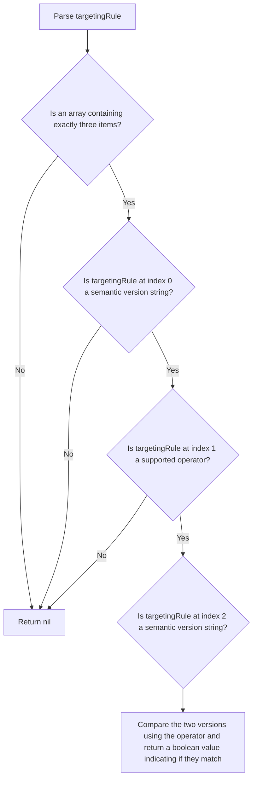

# Semantic Versioning Evaluation

This evaluator checks if the given property within the evaluation context matches a semantic versioning condition.
It returns 'true', if the value of the given property meets the condition, 'false' if not.

The implementation of this evaluator should accept the object containing the `sem_ver` evaluator
configuration, and a `data` object containing the evaluation context.
The 'sem_ver' evaluation rule contains exactly three items:

1. Target property value: the resolved value of the target property referenced in the targeting rule
2. Operator: One of the following: `=`, `!=`, `>`, `<`, `>=`, `<=`, `~` (match minor version), `^` (match major version)
3. Target value: this needs to resolve to a semantic versioning string

The `sem_ver` evaluation returns a boolean, indicating whether the condition has been met.

```js
{
    "if": [
        {
            "sem_ver": [{"var": "version"}, ">=", "1.0.0"]
        },
        "red", null
    ]
}
```

Please note that the implementation of this evaluator can assume that instead of `{"var": "version"}`, it will receive
the resolved value of that referenced property, as resolving the value will be taken care of by JsonLogic before
applying the evaluator.

The following flow chart depicts the logic of this evaluator:

