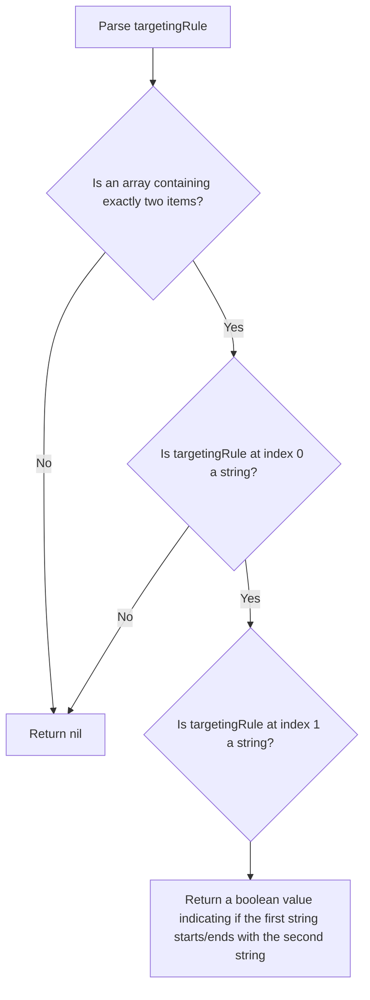

# StartsWith/EndsWith evaluation

This evaluator selects a variant based on whether the specified property within the evaluation context
starts/ends with a certain string.

The implementation of this evaluator should accept the object containing the `starts_with` or `ends_with` evaluator
configuration, and a `data` object containing the evaluation context.
The `starts_with`/`ends_with` evaluation rule contains exactly two items:

1. The resolved string value from the evaluation context
2. The target string value

The `starts_with`/`ends_with` evaluation returns a boolean, indicating whether the condition has been met.

```js
// starts_with property name used in a targeting rule
"starts_with": [
  // Evaluation context property the be evaluated
  {"var": "email"},
  // prefix that has to be present in the value of the referenced property  
  "user@faas"
]
```

Please note that the implementation of this evaluator can assume that instead of `{"var": "email"}`, it will receive
the resolved value of that referenced property, as resolving the value will be taken care of by JsonLogic before
applying the evaluator.

The following flow chart depicts the logic of this evaluator:

