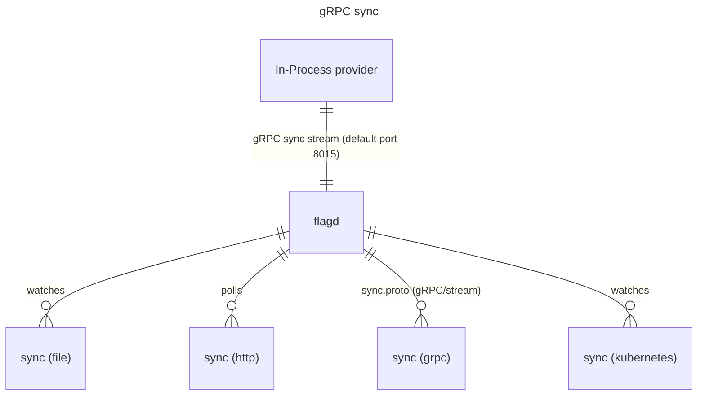

# Overview

flagd can expose a gRPC sync service, allowing in-process providers to obtain their flag definitions.
This mode is **disabled** by default, and you can enable it by using startup flag `--sync-enabled` (or `-e` shorthand flag).
The gRPC sync stream contains flag definitions currently configured at flagd as [sync-configurations](./sync-configuration.md).



You may change the default port of the service using startup flag `--sync-port` (or `-g` shothand flag).

By default, the gRPC stream expose all the flag configurations merged following merge strategy of flagd.
You can read more about the merge strategy in our dedicated [concepts guide on syncs](../concepts/syncs.md).

If you specify a `selector` in the gRPC sync request, the gRPC service will attempt match the provided selector valur to a source and stream specific flags.
For example, if `selector` is set to `myFlags.json`, service will stream flags observed from `myFlags.json` file.
And the request will fail if there is no flag source matching the requested `selector`.
flagd provider implementations expose the ability to define the `selector` value.

```java
final FlagdProvider flagdProvider =
        new FlagdProvider(FlagdOptions.builder()
                .resolverType(Config.Evaluator.IN_PROCESS)
                .host("localhost")
                .port(8015)
                .selector("myFlags.json")
                .build());
```
