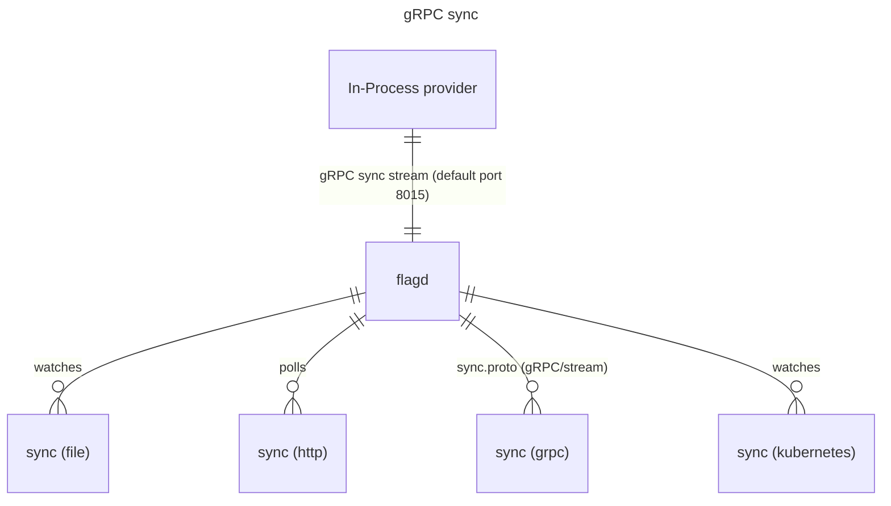

# Overview

flagd can expose a gRPC sync service, allowing in-process providers to obtain their flag definitions.
The gRPC sync stream contains flag definitions currently configured at flagd as [sync-configurations](./sync-configuration.md).


```mermaid
---
title: gRPC sync
---
erDiagram
    flagd ||--o{ "sync (file)" : watches
    flagd ||--o{ "sync (http)" : polls
    flagd ||--o{ "sync (grpc)" : "sync.proto (gRPC/stream)"
    flagd ||--o{ "sync (kubernetes)" : watches
    "In-Process provider" ||--|| flagd : "gRPC sync stream (default port 8015)"
```

You may change the default port of the service using startup flag `--sync-port` (or `-g` shothand flag).

By default, the gRPC stream exposes all the flag configurations, with conflicting flag keys merged following flag's standard merge strategy.
You can read more about the merge strategy in our dedicated [concepts guide on syncs](../concepts/syncs.md).

If you specify a `selector` in the gRPC sync request, the gRPC service will attempt match the provided selector value to
a source, and stream just the flags identified in that source.
For example, if `selector` is set to `myFlags.json`, service will stream flags observed from `myFlags.json` file.
Note that, to observe flags from `myFlags.json` file, you may use startup option `uri` like `--uri myFlags.json` or
`source` option `--sources='[{"uri":"myFlags.json", provider":"file"}]`.
And the request will fail if there is no flag source matching the requested `selector`.

flagd provider implementations expose the ability to define the `selector` value. Please consider below example for
Java,

```java
final FlagdProvider flagdProvider =
        new FlagdProvider(FlagdOptions.builder()
                .resolverType(Config.Evaluator.IN_PROCESS)
                .host("localhost")
                .port(8015)
                .selector("myFlags.json")
                .build());
```

See the [cheat sheet](./cheat-sheet.md#grpc-sync-api-syncproto) for `grpcurl` examples using `FetchAllFlags` and `SyncFlags`.

## HTTP flag configuration endpoint

flagd also serves the same flag configuration over plain HTTP, as the unary equivalent of `FetchAllFlags`.
This is useful for clients that cannot speak gRPC, and it lets one flagd instance use another as an [HTTP sync source](./sync-configuration.md).

The endpoint is served on the sync port itself (`8015` by default), alongside gRPC: connections are split on the HTTP/2 preface, so gRPC keeps its own HTTP/2 server and its keepalive settings.
TLS, when configured, covers both.

Because every HTTP/2 connection is routed to gRPC, this endpoint is served over HTTP/1.1.
Ordinary clients need no configuration for this: over TLS the server's ALPN preference settles them on `http/1.1`, and over plaintext they do not attempt HTTP/2 in the first place.
A client forcing prior-knowledge h2c will reach the gRPC service instead.
Set `--sync-http-enabled=false` to disable the endpoint.

```shell
curl http://localhost:8015/v1/flags
```

The response body is the flag configuration document itself, identical to the string `FetchAllFlags` returns in its `flag_configuration` field:

```json
{
  "flags": {
    "myBoolFlag": {
      "state": "ENABLED",
      "defaultVariant": "on",
      "variants": {
        "on": true,
        "off": false
      }
    }
  }
}
```

### Selecting flags

The [selector](./selector-syntax.md) may be supplied three ways, in descending order of precedence:

```shell
# 1. the Flagd-Selector header, consistent with the other flagd services
curl -H 'Flagd-Selector: flagSetId=payments' http://localhost:8015/v1/flags

# 2. a path segment; the expression is a single segment, so it must be URL-escaped
curl http://localhost:8015/v1/flags/flagSetId%3Dpayments

# 3. a query parameter
curl 'http://localhost:8015/v1/flags?selector=flagSetId=payments'
```

Source selectors routinely contain `/`, so escaping matters for the path form: `source=./flags.json` is requested as `/v1/flags/source%3D.%2Fflags.json`.
No file extension is stripped from the path segment, so a selector ending in `.json` is preserved as written.

The endpoint distinguishes three outcomes:

| Result                                       | Example                           | Status                    |
|----------------------------------------------|-----------------------------------|---------------------------|
| Selector string is not well-formed           | control characters, invalid UTF-8 | `400`                     |
| Well-formed, but names an unknown filter     | `bogus=1`                         | `404`                     |
| Valid filter that currently matches no flags | `flagSetId=empty-set`             | `200` with `{"flags":{}}` |

An empty result is deliberately not a `404`: a flag set holding no flags is a normal state, and a downstream flagd syncing from this endpoint should not break when it happens.

### Caching

Responses carry both validators, so pollers can revalidate cheaply:

- `ETag` is computed from the response body, so it is exact for the requested selector.
- `Last-Modified` is the last time flagd observed a change to **any** flag configuration, not just the selected subset. It is therefore conservative: it may cost a request a `304` it could have had, but it never serves a stale one. An identical re-sync does not advance it.

`If-None-Match` and `If-Modified-Since` are both honored, with `If-None-Match` taking precedence when both are sent.

```shell
curl -H 'If-None-Match: "<etag>"' -i http://localhost:8015/v1/flags   # 304 Not Modified
```

### Chaining flagd instances

Because the body is an ordinary flag configuration document, another flagd can consume it directly:

```shell
flagd start --uri http://localhost:8015/v1/flags
```

flagd's HTTP sync sends `If-None-Match` on each poll, so steady-state polling costs a `304` with no body.

## Monitoring

The gRPC sync service is instrumented with OpenTelemetry metrics for monitoring active connections and stream lifecycles.
See the [Monitoring reference](./monitoring.md#grpc-sync-metrics) for the full list of exposed metrics and their attributes.
