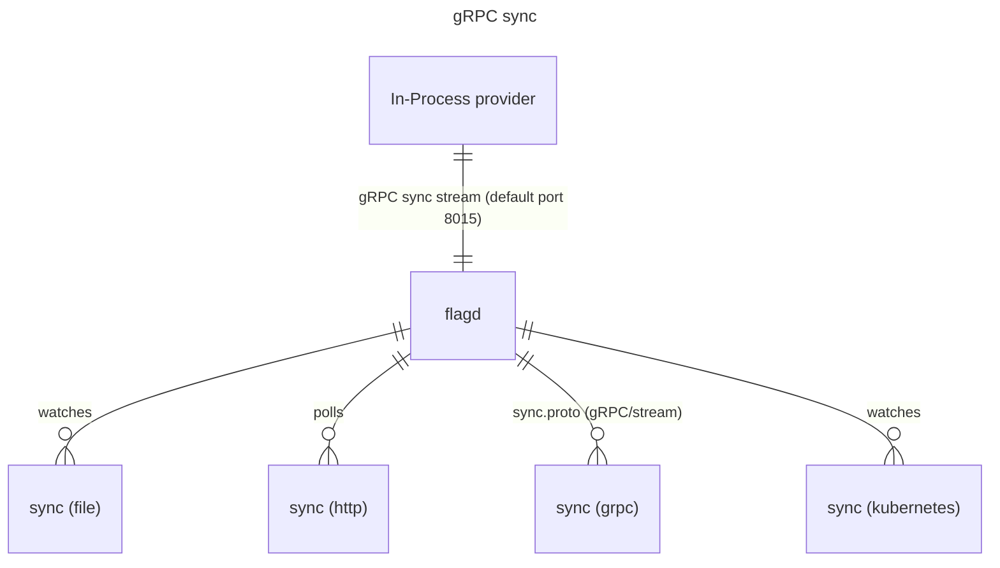

# Overview

flagd can expose a gRPC sync service, allowing in-process providers to obtain their flag definitions.
The gRPC sync stream contains flag definitions currently configured at flagd as [sync-configurations](./sync-configuration.md).


```mermaid
---
title: gRPC sync
---
erDiagram
    flagd ||--o{ "sync (file)" : watches
    flagd ||--o{ "sync (http)" : polls
    flagd ||--o{ "sync (grpc)" : "sync.proto (gRPC/stream)"
    flagd ||--o{ "sync (kubernetes)" : watches
    "In-Process provider" ||--|| flagd : "gRPC sync stream (default port 8015)"
```

You may change the default port of the service using startup flag `--sync-port` (or `-g` shothand flag).

!!! note "Client keepalive"

    `--keep-alive-min-time` and `--keep-alive-permit-without-stream` are still accepted, but they are
    now no-ops and flagd logs a warning if either is set to a non-default value. They configured
    grpc-go's keepalive enforcement policy, which has no equivalent now that the service is served by
    Connect over `net/http` and no longer needs one: the server imposes no minimum ping interval
    and does not require an active stream, so any client keepalive cadence is accepted. A connection
    holding no streams at all is reclaimed after 5 minutes.

By default, the gRPC stream exposes all the flag configurations, with conflicting flag keys merged following flag's standard merge strategy.
You can read more about the merge strategy in our dedicated [concepts guide on syncs](../concepts/syncs.md).

If you specify a `selector` in the gRPC sync request, the gRPC service will attempt match the provided selector value to
a source, and stream just the flags identified in that source.
For example, if `selector` is set to `myFlags.json`, service will stream flags observed from `myFlags.json` file.
Note that, to observe flags from `myFlags.json` file, you may use startup option `uri` like `--uri myFlags.json` or
`source` option `--sources='[{"uri":"myFlags.json", provider":"file"}]`.
And the request will fail if there is no flag source matching the requested `selector`.

flagd provider implementations expose the ability to define the `selector` value. Please consider below example for
Java,

```java
final FlagdProvider flagdProvider =
        new FlagdProvider(FlagdOptions.builder()
                .resolverType(Config.Evaluator.IN_PROCESS)
                .host("localhost")
                .port(8015)
                .selector("myFlags.json")
                .build());
```

See the [cheat sheet](./cheat-sheet.md#grpc-sync-api-syncproto) for `grpcurl` examples using `FetchAllFlags` and `SyncFlags`.

## Protocols

The sync service is served by a [Connect](https://connectrpc.com) handler, so one port speaks three
protocols: gRPC, gRPC-Web, and Connect's own HTTP/1.1-friendly protocol. Nothing changes for gRPC
clients. TLS, when configured, covers all of them, and plaintext HTTP/2 is served over h2c so gRPC
clients need no TLS.

`FetchAllFlags` is therefore also callable with a plain JSON body, for clients that cannot speak
gRPC:

```shell
curl -X POST http://localhost:8015/flagd.sync.v1.FlagSyncService/FetchAllFlags \
  -H 'Content-Type: application/json' -d '{}'
```

That returns the RPC response, which carries the configuration as a string in `flag_configuration`.
When you want the configuration document itself, use the endpoint below.

## HTTP flag configuration endpoint

flagd also serves the flag configuration as an ordinary cacheable `GET`, on the sync port itself
(`8015` by default) alongside the RPC routes. This is the form to use for polling clients and it lets
one flagd instance use another as an [HTTP sync source](./sync-configuration.md).
Set `--sync-http-enabled=false` to disable it.

```shell
curl http://localhost:8015/v1/flags
```

The response body is the flag configuration document itself — not the `FetchAllFlags` envelope — and
is byte-identical to the string that RPC returns in its `flag_configuration` field:

```json
{
  "flags": {
    "myBoolFlag": {
      "state": "ENABLED",
      "defaultVariant": "on",
      "variants": {
        "on": true,
        "off": false
      }
    }
  }
}
```

### Selecting flags

The [selector](./selector-syntax.md) is supplied with the `Flagd-Selector` header, consistent with
the other flagd services:

```shell
curl -H 'Flagd-Selector: flagSetId=payments' http://localhost:8015/v1/flags
```

The endpoint distinguishes three outcomes:

| Result                                       | Example                           | Status                    |
|----------------------------------------------|-----------------------------------|---------------------------|
| Selector string is not well-formed           | control characters, invalid UTF-8 | `400`                     |
| Well-formed, but names an unknown filter     | `bogus=1`                         | `404`                     |
| Valid filter that currently matches no flags | `flagSetId=empty-set`             | `200` with `{"flags":{}}` |

An empty result is deliberately not a `404`: a flag set holding no flags is a normal state, and a downstream flagd syncing from this endpoint should not break when it happens.
The RPC surface reports both selector failures as `invalid_argument`, since it has no equivalent of the `400`/`404` split.

### Caching

Responses carry both validators, so pollers can revalidate cheaply:

- `ETag` is computed from the response body, so it is exact for the requested selector.
- `Last-Modified` is the last time flagd observed a change to **any** flag configuration, not just the selected subset. It is therefore conservative: it may cost a request a `304` it could have had, but it never serves a stale one. An identical re-sync does not advance it.

`If-None-Match` and `If-Modified-Since` are both honored, with `If-None-Match` taking precedence when both are sent.

```shell
curl -H 'If-None-Match: "<etag>"' -i http://localhost:8015/v1/flags   # 304 Not Modified
```

### Chaining flagd instances

Because the body is an ordinary flag configuration document, another flagd can consume it directly:

```shell
flagd start --uri http://localhost:8015/v1/flags
```

To sync only a subset, set the selector header on the source, which needs the `--sources` form:

```shell
flagd start --sources='[{"uri":"http://localhost:8015/v1/flags","provider":"http","headers":{"Flagd-Selector":"flagSetId=payments"}}]'
```

flagd's HTTP sync sends `If-None-Match` on each poll, so steady-state polling costs a `304` with no body.

### Request limits

Request bodies are capped by `--max-request-body` (`-B`), the same flag the evaluation and OFREP
services honour; oversized RPC requests are rejected with `resource_exhausted`. Connect imposes no
receive limit of its own, so setting the flag to `0` leaves the sync service unbounded, where the
gRPC server it replaced fell back to grpc-go's 4 MiB default.

## Monitoring

The gRPC sync service is instrumented with OpenTelemetry metrics for monitoring active connections and stream lifecycles.
See the [Monitoring reference](./monitoring.md#grpc-sync-metrics) for the full list of exposed metrics and their attributes.
