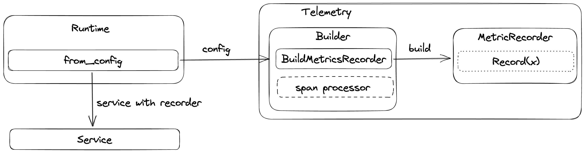

# Monitoring

## Readiness & Liveness probes

### HTTP

Flagd exposes HTTP liveness and readiness probes.
These probes can be used for K8s deployments.
With default start-up configurations, these probes are exposed on the management port (default: 8014) at the following URLs,

- Liveness: <http://localhost:8014/healthz>
- Readiness: <http://localhost:8014/readyz>

### gRPC

Flagd exposes a [standard gRPC liveness check](https://github.com/grpc/grpc/blob/master/doc/health-checking.md) on the management port (default: 8014).

### Definition of Liveness

The liveness probe becomes active and HTTP 200 status is served as soon as Flagd service is up and running.

### Definition of Readiness

The readiness probe becomes active similar to the liveness probe as soon as Flagd service is up and running.
However,
the probe emits HTTP 412 until all sync providers are ready.
This status changes to HTTP 200 when all sync providers at
least have one successful data sync.
The status does not change from there on.

## OpenTelemetry

flagd provides telemetry data out of the box. This telemetry data is compatible with OpenTelemetry.

By default, the Prometheus exporter is used for metrics which can be accessed via the `/metrics` endpoint. For example,
with default startup flags, metrics are exposed at `http://localhost:8014/metrics`.

Given below is the current implementation overview of flagd telemetry internals,



## Metrics

> Please note that metric names may vary based on the consuming monitoring tool naming requirements.
> For example, the transformation of OTLP metrics to Prometheus is described [here](https://github.com/open-telemetry/opentelemetry-specification/blob/main/specification/compatibility/prometheus_and_openmetrics.md#otlp-metric-points-to-prometheus).

### HTTP Metrics

These metrics apply to both the [flag evaluation](./specifications/protos.md) and [OFREP](./flagd-ofrep.md) endpoints. flagd uses the [OpenTelemetry Semantic Conventions for HTTP](https://opentelemetry.io/docs/specs/semconv/http/http-metrics/):

- `http.server.request.duration` - Measures the duration of inbound HTTP requests (seconds). Histogram buckets: 5ms, 10ms, 25ms, 50ms, 75ms, 100ms, 250ms, 500ms, 750ms, 1s, 2.5s, 5s, 7.5s, 10s.
- `http.server.request.body.size` - Measures the size of HTTP request messages (bytes)
- `http.server.response.body.size` - Measures the size of HTTP response messages (bytes)

For the full list of attributes on these metrics, see the [OpenTelemetry HTTP Server Metrics](https://opentelemetry.io/docs/specs/semconv/http/http-metrics/#http-server) semantic conventions.

### Flag Evaluation Metrics

These metrics are recorded on every [flag evaluation](./specifications/protos.md), regardless of transport (HTTP, gRPC, connect). Attribute names are inspired by the [OpenTelemetry Semantic Conventions for Feature Flags](https://opentelemetry.io/docs/specs/semconv/feature-flags/feature-flags-events/):

- `feature_flag.flagd.impression` - Measures the number of evaluations for a given flag
- `feature_flag.flagd.result.reason` - Measures the number of evaluations for a given reason

**Attributes:**

- `feature_flag.key` - The flag key being evaluated
- `feature_flag.result.variant` - The variant returned by the evaluation
- `feature_flag.provider.name` - The feature flag provider name (always `flagd`)
- `feature_flag.reason` - The evaluation reason (e.g. `STATIC`, `TARGETING_MATCH`, `ERROR`)

### gRPC Sync Metrics

flagd instruments the [gRPC sync service](./grpc-sync-service.md) with standard RPC metrics and custom sync-specific metrics.

#### Standard RPC metrics

flagd uses the [OpenTelemetry Semantic Conventions for RPC](https://pkg.go.dev/go.opentelemetry.io/contrib/instrumentation/google.golang.org/grpc/otelgrpc):

- `rpc.server.duration` - Measures the duration of inbound RPC calls (ms)
- `rpc.server.request.size` - Measures the size of RPC request messages (bytes)
- `rpc.server.response.size` - Measures the size of RPC response messages (bytes)
- `rpc.server.requests_per_rpc` - Measures the number of requests received per RPC
- `rpc.server.responses_per_rpc` - Measures the number of responses sent per RPC

**Attributes:**

- `rpc.system` - The RPC system (always `grpc`)
- `rpc.service` - The fully-qualified RPC service name (e.g. `flagd.sync.v1.FlagSyncService`)
- `rpc.method` - The RPC method name (e.g. `SyncFlags`, `FetchAllFlags`)
- `rpc.grpc.status_code` - The gRPC status code (e.g. `OK`, `CANCELLED`, `DEADLINE_EXCEEDED`)

#### Custom sync metrics

- `feature_flag.flagd.sync.active_streams` - Measures the number of currently active gRPC sync streaming connections
- `feature_flag.flagd.sync.stream.duration` - Measures the duration of gRPC sync streaming connections (seconds). Histogram buckets: 30s, 1min, 2min, 5min, 8min, 10min, 20min, 30min, 1h, 3h.

**Attributes:**

- `selector` - The selector expression used by the sync stream, when specified in the request
- `provider_id` - The provider ID of the connecting client, when specified in the request
- `reason` - Stream exit reason: `normal_close`, `deadline_exceeded`, `client_disconnect`, or `error` (on `stream.duration` only)

## Traces

flagd creates the following spans as part of a trace:

- `flagEvaluationService(resolveX)` - SpanKind server
    - `jsonEvaluator(resolveX)` - SpanKind internal
- `jsonEvaluator(setState)` - SpanKind internal

## Export to OTEL collector

flagd can be configured to connect to [OTEL collector](https://opentelemetry.io/docs/collector/). This requires startup
flag `metrics-exporter` to be `otel` and a valid `otel-collector-uri`. For example,

`flagd start --uri file:/flags.json --metrics-exporter otel --otel-collector-uri localhost:4317`

### Custom resource attributes

To attach custom resource attributes (e.g., environment name, deployment region) to flagd's exported telemetry, set the `OTEL_RESOURCE_ATTRIBUTES` environment variable before starting flagd:

```sh
export OTEL_RESOURCE_ATTRIBUTES="deployment.environment=staging,service.version=1.2.3"
export OTEL_EXPORTER_OTLP_ENDPOINT=localhost:4317
flagd start --uri file:/flags.json --metrics-exporter otel
```

These attributes follow the [OpenTelemetry resource semantic conventions](https://opentelemetry.io/docs/specs/semconv/resource/) and are attached to all exported metrics and traces.

> **Tip:** If you're setting resource attributes for environment identification, you may also want to configure [static context values (`-X`)](../reference/flag-definitions.md#static-context--x-flag) so these same dimensions are available for flag targeting.

To expose resource attributes as metric labels in Prometheus, enable `resource_to_telemetry_conversion` in your OpenTelemetry Collector exporter config:

```yaml
exporters:
  prometheus:
    endpoint: "0.0.0.0:8889"
    resource_to_telemetry_conversion:
      enabled: true
```

### Configure local collector setup

To configure a local collector setup along with Jaeger and Prometheus, you can use following sample docker-compose
file and configuration files.

Note - content is adopted from
official [OTEL collector example](https://github.com/open-telemetry/opentelemetry-collector-contrib/tree/main/examples/demo)

#### docker-compose.yaml

```yaml
services:
  jaeger:
    image: cr.jaegertracing.io/jaegertracing/jaeger:2.8.0
    restart: always
    ports:
      - "16686:16686"
      - "14268"
      - "14250"
  # Collector
  otel-collector:
    image: otel/opentelemetry-collector:0.129.1
    restart: always
    command: [ "--config=/etc/otel-collector-config.yaml" ]
    volumes:
      - ./otel-collector-config.yaml:/etc/otel-collector-config.yaml
    ports:
      - "1888:1888"   # pprof extension
      - "8888:8888"   # Prometheus metrics exposed by the collector
      - "8889:8889"   # Prometheus exporter metrics
      - "13133:13133" # health_check extension
      - "4317:4317"   # OTLP gRPC receiver
      - "55679:55679" # zpages extension
    depends_on:
      - jaeger
  prometheus:
    container_name: prometheus
    image: prom/prometheus:v2.53.5
    restart: always
    volumes:
      - ./prometheus.yaml:/etc/prometheus/prometheus.yml
    ports:
      - "9090:9090"
```

#### otel-collector-config.yaml

```yaml
receivers:
  otlp:
    protocols:
      grpc:
        endpoint: 0.0.0.0:4317
exporters:
  prometheus:
    endpoint: "0.0.0.0:8889"
  otlp/jaeger:
    endpoint: jaeger:4317
    tls:
      insecure: true
processors:
  batch:
service:
  pipelines:
    traces:
      receivers: [ otlp ]
      processors: [ batch ]
      exporters: [ otlp/jaeger ]
    metrics:
      receivers: [ otlp ]
      processors: [ batch ]
      exporters: [ prometheus ]
```

#### prometheus.yaml

```yaml
scrape_configs:
  - job_name: 'otel-collector'
    scrape_interval: 10s
    static_configs:
      - targets: [ 'otel-collector:8889' ]
```

Once, configuration files are ready, use `docker compose up` to start the local setup. With successful startup, you can
access metrics through [Prometheus](http://localhost:9090/graph) & traces through [Jaeger](http://localhost:16686/).

## Metadata

[Flag metadata](https://openfeature.dev/specification/types/#flag-metadata) comprises auxiliary data pertaining to feature flags; it's highly valuable in telemetry signals.
Flag metadata might consist of attributes indicating the version of the flag, an identifier for the flag set, ownership information about the flag, or other documentary information.
flagd supports flag metadata in all its [gRPC protocols](../reference/specifications//protos.md), in [OFREP](../reference/flagd-ofrep.md), and in its [flag definitions](./flag-definitions.md#metadata).
These attributes are returned with flag evaluations, and can be added to telemetry signals as outlined in the [OpenFeature specification](https://openfeature.dev/specification/appendix-d).
