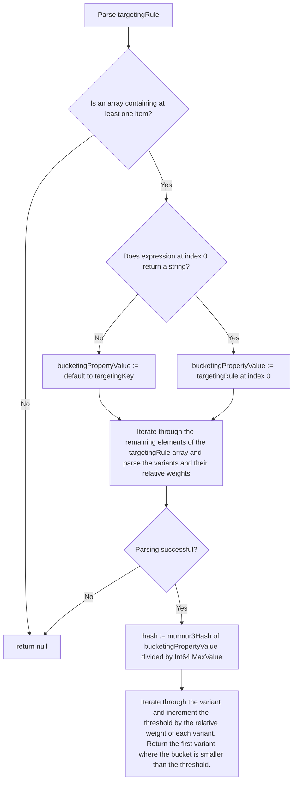

# Fractional Operation Specification

This evaluator allows to split the returned variants of a feature flag into different buckets,
where each bucket can be assigned a weight, representing how many requests will resolve to the corresponding
variant.

The distribution must be performed by using the value of a referenced property
from the evaluation context to hash that value and map it to a value between [0, 100]. It is important to note
that evaluations MUST be sticky, meaning that flag resolution requests containing the same value for the
referenced property in their context MUST always resolve to the same variant. For calculating the hash value of the
referenced evaluation context property, the [MurmurHash3](https://github.com/aappleby/smhasher/blob/master/src/MurmurHash3.cpp)
hash function should be used. This is to ensure that flag resolution requests yield the same result,
regardless of which implementation of the in-process flagd provider is being used.

The supplied array must contain at least two items, with the first item being an optional [json logic variable declaration](https://jsonlogic.com/operations.html#var)
specifying the bucketing property to base the distribution of values on. If the bucketing property expression doesn't return a string, a concatenation of the
`flagKey` and `targetingKey` are used: `{"cat": [{"var":"$flagd.flagKey"}, {"var":"targetingKey"}]}`.
The remaining items are `arrays`, each with at least one value, with the first being `string` item representing the name of the variant, and the
second being an optional `float` item representing the relative weight for that variant.
If no relative weight is specified explicitly, the weight for that variant must be set to `1` be default.
The `data` object can be an arbitrary
JSON object. Below is an example of a targeting rule containing a `fractional`, with relative weights assigned to the variants:

```json
{
  "$schema": "https://flagd.dev/schema/v0/flags.json",
  "flags": {
    "headerColor": {
      "variants": {
        "red": "#FF0000",
        "blue": "#0000FF",
        "green": "#00FF00"
      },
      "defaultVariant": "red",
      "state": "ENABLED",
      "targeting": {
        "fractional": [
          {
            "cat": [
              { "var": "$flagd.flagKey" },
              { "var": "email" }
            ]
          },
          [
            "red",
            50
          ],
          [
            "blue",
            20
          ],
          [
            "green",
            30
          ]
        ]
      }
    }
  }
}
```

An example for a `fractional` targeting rule with no relative weights being assigned to the variants is listed below.
This will achieve an even distribution of the different variants:

```json
{
  "$schema": "https://flagd.dev/schema/v0/flags.json",
  "flags": {
    "headerColor": {
      "variants": {
        "red": "#FF0000",
        "blue": "#0000FF",
        "green": "#00FF00"
      },
      "defaultVariant": "red",
      "state": "ENABLED",
      "targeting": {
        "fractional": [
          {
            "cat": [
              { "var": "$flagd.flagKey" },
              { "var": "email" }
            ]
          },
          [
            "red"
          ],
          [
            "blue"
          ],
          [
            "green"
          ]
        ]
      }
    }
  }
}
```

Please note that the implementation of this evaluator can assume that instead of `{"var": "email"}`, it will receive
the resolved value of that referenced property, as resolving the value will be taken care of by JsonLogic before
applying the evaluator.

The following flow chart depicts the logic of this evaluator:



As a reference, below is a simplified version of the actual implementation of this evaluator in Go.

```go

type fractionalEvaluationDistribution struct {
    variant    string
    weight int
}

/*
    values: contains the targeting rule object; e.g.:
        [
          {"var":"email"},
          [
            "red",
            50
          ],
          [
            "blue",
            20
          ],
          [
            "green",
            30
          ]
        ]
    
    data: contains the evaluation context; e.g.:
        {
            "email": "test@faas.com"
        }
*/ 
func FractionalEvaluation(values, data interface{}) interface{} {
    // 1. Check if the values object contains at least two elements:
    valuesArray, ok := values.([]interface{})
    if !ok {
        log.Error("fractional evaluation data is not an array")
        return nil
    }
    if len(valuesArray) < 2 {
        log.Error("fractional evaluation data has length under 2")
        return nil
    }

    // 2. Get the target property value used for bucketing the values
    valueToDistribute, ok := valuesArray[0].(string)
    if !ok {
        log.Error("first element of fractional evaluation data isn't of type string")
        return nil
    }

    // 3. Parse the fractional values distribution
    sumOfWeights := 0
    var feDistributions []fractionalEvaluationDistribution

    // start at index 1, as the first item of the values array is the target property
    for i := 1; i < len(valuesArray); i++ {
        distributionArray, ok := values[i].([]interface{})
        if !ok {
            log.Error("distribution elements aren't of type []interface{}")
            return nil
        }

        if len(distributionArray) == 0 {
            log.Error("distribution element needs to have a least one value")
            return nil
        }

        variant, ok := distributionArray[0].(string)
        if !ok {
            log.Error("first element of distribution element isn't a string")
            return nil
        }

        weight := 1.0
        if len(distributionArray) >= 2 {
            distributionWeight, ok := distributionArray[1].(float64)
            if ok {
                // default the weight to 1 if not specified explicitly
                weight = distributionWeight
            }
        }

        sumOfWeights += int(weight)

        feDistributions = append(feDistributions, fractionalEvaluationDistribution{
            variant:    variant,
            weight: int(weight),
        })
    }

    // 4. Calculate the hash of the target property and map it to a number between [0, 99] 
    hashValue := int32(murmur3.StringSum32(value))
    hashRatio := math.Abs(float64(hashValue)) / math.MaxInt32
    bucket := int(hashRatio * 100)

    // 5. Iterate through the variant and increment the threshold by the percentage of each variant.
    // return the first variant where the bucket is smaller than the threshold. 
    rangeEnd := 0
    for _, dist := range feDistribution {
        rangeEnd += (dist.weight / sumOfWeights) * 100
        if bucket < rangeEnd {
            // return the matching variant
            return dist.variant
        }
    }

    return ""
}
```
