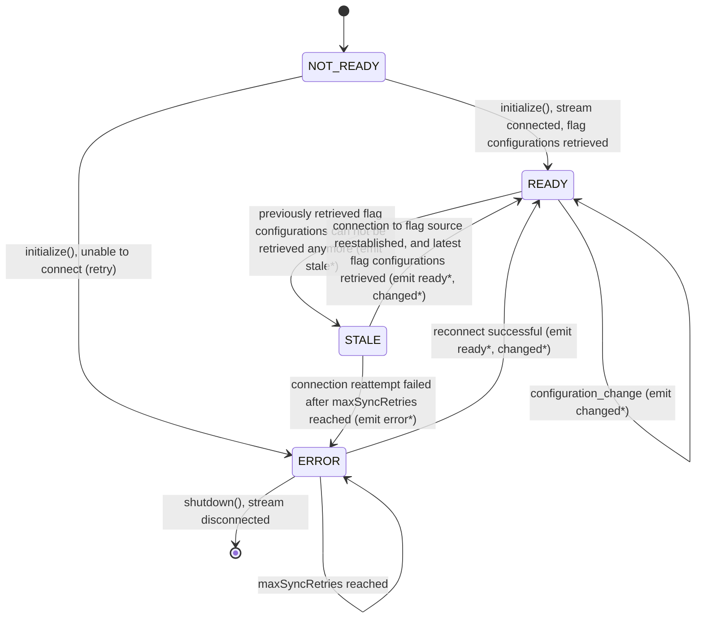
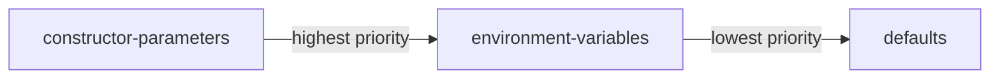

# Creating an in-process flagd provider

An in-process flagd provider, on the other hand, is designed to be embedded into the application, and therefore
no communication outside the process of the application for feature flag evaluation is needed. This can be desired by some architectures,
especially if flag retrievals should not take longer than a certain amount of time.

The in-process flagd provider is responsible for creating an abstraction between the [JsonLogic](https://jsonlogic.com) based evaluation of flag configurations following the [flag configuration scheme](https://github.com/open-feature/schemas/blob/main/json/flagd-definitions.json) used by `flagd` and the OpenFeature SDK (for the [chosen technology](https://openfeature.dev/docs/reference/technologies/)).

Prerequisites:

- Understanding of [general provider concepts](https://openfeature.dev/docs/reference/concepts/provider/)
- Proficiency in the chosen programming language (check the language isn't already covered by the [existing providers](../usage/flagd_providers.md))

The Flag definition containing the feature flags and JsonLogic based targeting rules shall be retrieved by the
in-process flagd provider via a gRPC client connection to a sync server, such as [flagd-proxy](https://github.com/open-feature/flagd/tree/main/flagd-proxy).

## Sync source

An implementation of an in-process flagd-provider must accept the following environment variables which determine the sync source:

- `FLAGD_SOURCE_URI`: The URI identifying the sync source. Depending on the sync provider type, this can be the URI of a gRPC service providing the `sync` API required by the in-process flagd provider, or the name of a [core.openfeature.dev/v1alpha2.FeatureFlagConfiguration](https://github.com/open-feature/open-feature-operator/blob/main/docs/crds.md#featureflagconfiguration-1) Custom Resource containing the flag definition.
- `FLAGD_SOURCE_PROVIDER_TYPE`: The type of the provider. E.g. `grpc` or `kubernetes`.
- `FLAGD_SOURCE_SELECTOR`: Optional selector for the feature flag definition of interest. This is used as a `selector` for the flagd-proxie's sync API to identify a flag definition within a collection of feature flag definitions.

An implementation of an in-process flagd provider should provide a source for retrieving the flag definition, namely a gRPC source.
Other sources may be desired eventually, so separation of concerns should be maintained between the abstractions evaluating flags and those retrieving confirmation.

## gRPC sources

gRPC sync sources are identified by the `provider` field set to `grpc`.
When such a sync source is specified, the in-process flagd provider should connect to the gRPC service located at the `uri` of the sync source, and use its [sync API](./protos.md#syncv1sync_serviceproto) to retrieve the feature flag definition.
If the `selector` field of the sync source is set, that selector should be passed through to the `Sync` and `FetchAllFlags` requests sent to the gRPC server.

### Protobuf

Protobuf schemas define the contract between a client (flagd or the in-process provider implementation) and server (`flagd-proxy`).
`flagd-proxy`'s schemas are defined [here](https://github.com/open-feature/schemas/tree/main/protobuf/sync/v1).

#### Code generation for gRPC sync

Leverage the [buf CLI](https://docs.buf.build/installation) or [protoc](https://grpc.io/docs/protoc-installation/) to generate a `flagd-proxy` client in the chosen technology:

Add the [open-feature schema repository](https://github.com/open-feature/schemas) as a submodule

```shell
git submodule add --force https://github.com/open-feature/schemas.git
```

Create a `buf.gen.{chosen language}.yaml` for the chosen language in `schemas/protobuf` (if it doesn't already exist) using one of the other files as a template (find a plugin for the chosen language [here](https://buf.build/protocolbuffers/plugins)) and create a pull request with this file.

Generate the code (this step ought to be automated in the build process for the chosen technology so that the generated code is never committed)

```shell
cd schemas/protobuf
buf generate --template buf.gen.{chosen language}.yaml
```

As an alternative to buf, use the .proto file directly along with whatever protoc-related tools or plugins avaialble for your language.

Move the generated code (following convention for the chosen language) and add its location to .gitignore

Note that for the in-process provider only the `sync` package will be relevant, as it does not communicate with `flagd`, but only with compliant gRPC services such as `flagd-proxy`.

## JsonLogic evaluation

An in-process flagd provider should provide the feature set offered by [JsonLogic](https://jsonlogic.com) to evaluate flag resolution requests for a given context.
If available, the JsonLogic library for the chosen technology should be used.

### Custom JsonLogic evaluators

In addition to the built-in evaluators provided by JsonLogic, the following custom targeting rules should be implemented by the provider:

- [Fractional operation](../../reference/custom-operations/fractional-operation.md):
This evaluator allows the splitting of the returned variants of a feature flag into different buckets, where each bucket
can be assigned a percentage, representing how many requests will resolve to the corresponding variant.
The sum of all weights must be 100, and the distribution must be performed by using the value of a referenced
from the evaluation context to hash that value and map it to a value between [0, 100].
It is important to note that evaluations MUST be sticky, meaning that flag resolution requests containing the
same value for the referenced property in their context MUST always resolve to the same variant.
For calculating the hash value of the referenced evaluation context property,
the [MurmurHash3](https://github.com/aappleby/smhasher/blob/master/src/MurmurHash3.cpp) hash function should be used.
This is to ensure that flag resolution requests yield the same result, regardless of which implementation of
the in-process flagd provider is being used. For more specific implementation guidelines, please refer to
[this document](./custom-operations/fractional-operation-spec.md).
- [Semantic version evaluation](../../reference/custom-operations/semver-operation.md):
This evaluator checks if the given property within the evaluation context matches a semantic versioning condition.
It returns 'true', if the value of the given property meets the condition, 'false' if not.
For more specific implementation guidelines, please refer to [this document](../specifications/custom-operations/semver-operation-spec.md).
- [StartsWith/EndsWith evaluation](../../reference/custom-operations/string-comparison-operation.md):
This evaluator selects a variant based on whether the specified property within the evaluation context
starts/ends with a certain string.
For more specific implementation guidelines, please refer to [this document](./custom-operations/string-comparison-operation-spec.md).

## Provider construction

(**using Go as an example**)

Create a provider struct/class/type (whichever is relevant to the chosen language) with an exported (public) constructor allowing configuration (e.g. `flagd` host).
Give the provider an un-exported (private) client field, set this field as the client generated by the previous step.

Create methods for the provider to satisfy the chosen language SDK's provider interface.
These methods ought to wrap the built client's methods.

```go
type Provider struct {
    evaluator IJsonEvaluator
}

type ProviderOption func(*Provider)

func NewProvider(options ...ProviderOption) *Provider {
    provider := &Provider{}
    for _, opt := range opts {
        opt(provider)
    }

    // create a store that is responsible for retrieving the flag configurations
    // from the sources that are given to the provider via the options
    s := store.NewFlags()
    s.FlagSources = append(s.FlagSources, os.Getenv("FLAGD_SOURCE_URI"))
    s.SourceMetadata[provider.URI] = store.SourceDetails{
        Source:   os.Getenv("FLAGD_SOURCE_URI"),
        Selector: os.Getenv("FLAGD_SOURCE_SELECTOR")),
    }

    // derive evaluator
    provider.evaluator := setupJSONEvaluator(logger, s)
 
    return provider
}

func WithHost(host string) ProviderOption {
    return func(p *Provider) {
        p.flagdHost = host
    }
}

func (p *Provider) BooleanEvaluation(
    ctx context.Context, flagKey string, defaultValue bool, evalCtx of.FlattenedContext,
) of.BoolResolutionDetail {

    res, err := p.evaluator.ResolveBoolean(ctx, flagKey, context)

    if err != nil {
        return of.BoolResolutionDetail{
            Value: defaultValue,
            ProviderResolutionDetail: of.ProviderResolutionDetail{
                ResolutionError: of.NewGeneralResolutionError(err.Error()),
                Reason:          of.Reason(res.Reason),
                Variant:         res.Variant,
            },
        }
    }

    return of.BoolResolutionDetail{
        Value: defaultValue,
        ProviderResolutionDetail: of.ProviderResolutionDetail{
            Reason:          of.Reason(res.Reason),
            Variant:         res.Variant,
        },
    }
}

// ...
```

## Provider lifecycle, initialization and shutdown

With the release of the v0.6.0 spec, OpenFeature now outlines a lifecycle for in-process flagd provider initialization and shutdown.

In-process flagd providers should do the following to make use of OpenFeature v0.6.0 features:

- start in a `NOT_READY` state
- fetch the flag definition specified in the sync provider sources and set `state` to `READY` or `ERROR` in the `initialization` function
  - note that the SDK will automatically emit `PROVIDER_READY`/`PROVIDER_ERROR` according to the termination of the `initialization` function
- throw an exception or terminate abnormally if a connection cannot be established during `initialization`
- For gRPC based sources (i.e. flagd-proxy), attempt to restore the streaming connection to flagd-proxy (if the connection cannot be established or is broken):
  - If flag definition have been retrieved previously, go into `STALE` state to indicate that flag resolution responses are based on potentially outdated Flag definition.
  - reconnection should be attempted with an exponential back-off, with a max-delay of `maxSyncRetryInterval` (see [configuration](#configuration))
  - reconnection should be attempted up to `maxSyncRetryDelay` times (see [configuration](#configuration))
  - `PROVIDER_READY` and `PROVIDER_CONFIGURATION_CHANGED` should be emitted, in that order, after successful reconnection
- For Kubernetes sync sources, retry to retrieve the FlagConfiguration resource, using an exponential back-off strategy, with a max-delay of `maxSyncRetryInterval` (see [configuration](#configuration))
- emit `PROVIDER_CONFIGURATION_CHANGED` event and update the ruleset when a `configuration_change` message is received on the streaming connection
- close the streaming connection in the `shutdown` function



\* ready=`PROVIDER_READY`, changed=`PROVIDER_CONFIGURATION_CHANGED`, stale=`PROVIDER_STALE`, error=`PROVIDER_ERROR`

## Configuration

Expose means to configure the provider aligned with the following priority system (highest to lowest).



### Explicit declaration

This takes the form of parameters to the provider's constructor, it has the highest priority.

### Environment variables

Read environment variables with sensible defaults (before applying the values explicitly declared to the constructor).

| Option name                 | Environment variable name             | Type    | Options      | Default                                |
| --------------------------- | ------------------------------------- | ------- | ------------ | -------------------------------------- |
| host                        | FLAGD_PROXY_HOST                      | string  |              | localhost                              |
| port                        | FLAGD_PROXY_PORT                      | number  |              | 8013                                   |
| tls                         | FLAGD_PROXY_TLS                       | boolean |              | false                                  |
| socketPath                  | FLAGD_PROXY_SOCKET_PATH               | string  |              |                                        |
| certPath                    | FLAGD_PROXY_SERVER_CERT_PATH          | string  |              |                                        |
| sourceURI                   | FLAGD_SOURCE_URI                      | string  |              |                                        |
| sourceProviderType          | FLAGD_SOURCE_PROVIDER_TYPE            | string  |              | grpc                                   |
| sourceSelector              | FLAGD_SOURCE_SELECTOR                 | string  |              |                                        |
| maxSyncRetries              | FLAGD_MAX_SYNC_RETRIES                | int     |              | 0 (0 means unlimited)                  |
| maxSyncRetryInterval        | FLAGD_MAX_SYNC_RETRY_INTERVAL         | int     |              | 60s                                    |

## Error handling

Handle flag evaluation errors by using the error constructors exported by the SDK (e.g. `openfeature.NewProviderNotReadyResolutionError(ConnectionError)`), thereby allowing the SDK to parse and handle the error appropriately.

## Post creation

The following steps will extend the reach of the newly created provider to other developers of the chosen technology.

### Open an issue to document the provider

Create an issue [here](https://github.com/open-feature/openfeature.dev/issues/new?assignees=&labels=provider&template=document-provider.yaml&title=%5BProvider%5D%3A+) for adding the provider to [openfeature.dev](https://openfeature.dev).
