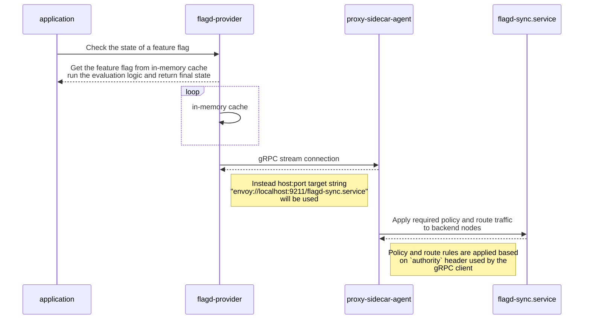

# gRPC Custom Name Resolver Proposal

## Details

|                        |                                    |
|------------------------|------------------------------------|
| **Feature Name**       | gRPC custom name resolver          |
| **Type**               | enhancement                        |
| **Related components** | gRPC source resolution             |

## Summary

gRPC by default supports DNS resolution which is currently being used e.g. "localhost:8013" in both
[core](https://github.com/open-feature/flagd/blob/main/core/pkg/sync/grpc/grpc_sync.go#L72-L74) and
providers e.g. [java](https://github.com/open-feature/java-sdk-contrib/blob/main/providers/flagd/src/main/java/dev/openfeature/contrib/providers/flagd/resolver/common/ChannelBuilder.java#L53-L55).
This covers most deployments, but with increased adoption of microservice-architecture, service discovery,
policy-enabled service meshes (e.g. istio, envoy, consul, etc) it's necessary to support custom routing and name resolution.

For such cases the gRPC core libraries support few alternative resolver* also expose the required interfaces to build custom implementations:

### Reference

* [Custom Name Resolution](https://grpc.io/docs/guides/custom-name-resolution/)
* [Java Client](https://grpc.github.io/grpc-java/javadoc/io/grpc/ManagedChannelBuilder.html#forTarget(java.lang.String))
* [Golang](https://pkg.go.dev/google.golang.org/grpc#NewClient)

**Note:** There is small variation in supported alternative resolver e.g. java support `zooKeeper`

## Motivation

The main motivation is to support complex deployments with a generic custom name resolver using the interface
provided by gRPC core*.

**Note**: As of now only `java` and `golang` has the required interface to create custom resolver

## Detailed design

The idea is to

* allow a new config option to pass the [target](https://grpc.io/docs/guides/custom-name-resolution/#life-of-a-target-string) string
* reduce need to create/override existing implementations to simplify use of name-resolver

### Target String Pattern*

Below is an example of a custom target string which will use envoy sidecar proxy for name resolution

```text
envoy://localhost:9211/flagd-sync.service
```

The custom name resolver provider in this case will use the endpoint name i.e. `flagd-sync.service` as [authority](https://github.com/grpc/grpc-java/blob/master/examples/src/main/java/io/grpc/examples/nameresolve/ExampleNameResolver.java#L55-L61)
and connect to `localhost:9211`



#### Drawbacks

* One of the big drawback was limited support of the language only `java` and `golang`
* Will introduce inconsistent user experience
* Will open the door for different use cases although this can be fixed by
providing sdks similar to [custom connector](https://github.com/open-feature/java-sdk-contrib/tree/main/providers/flagd#custom-connector)
* ...

## Alternatives

### Option-1

Allow users to override default `authority` header as shown above in `grpcurl`, the override option was
already supported by all major languages*

* [Golang](https://pkg.go.dev/google.golang.org/grpc#WithAuthority)
* [JAVA](https://grpc.github.io/grpc-java/javadoc/io/grpc/ForwardingChannelBuilder2.html#overrideAuthority(java.lang.String))
* [Python](https://grpc.github.io/grpc/python/glossary.html#term-channel_arguments)

this option is simple and easy to implement, although it will not cover all the cases it will at least help with proxy
setup where `host_header` was used to route traffic.

**Ref**:

Java PR: <https://github.com/open-feature/java-sdk-contrib/pull/949>

**Note**: JS, .NET, PHP still need to be explored if this options available

### Option-2

Only support the [xDS](https://grpc.io/docs/guides/custom-load-balancing/#service-mesh) protocol which already supported by gRPC core and doesn't require any custom
name resolver we can simply use any `target` string with `xds://` scheme. The big benefit of this approach was
it's going to be new stranded when it comes gRPC with service mesh and eliminate any custom implementation in `flagd`
and the gRPC core team actively adding more features e.g. mTLS

For more details refer the below document

* [gRPC xDS Feature](https://grpc.github.io/grpc/core/md_doc_grpc_xds_features.html)
* [gRPC xDS RFC](https://github.com/grpc/proposal/blob/master/A52-xds-custom-lb-policies.md)

### Option-3

TBD

## Unresolved questions

* What to do with un-supported languages
* Coming up with generic name resolver which will cover most of the cases not just proxy
* ....
