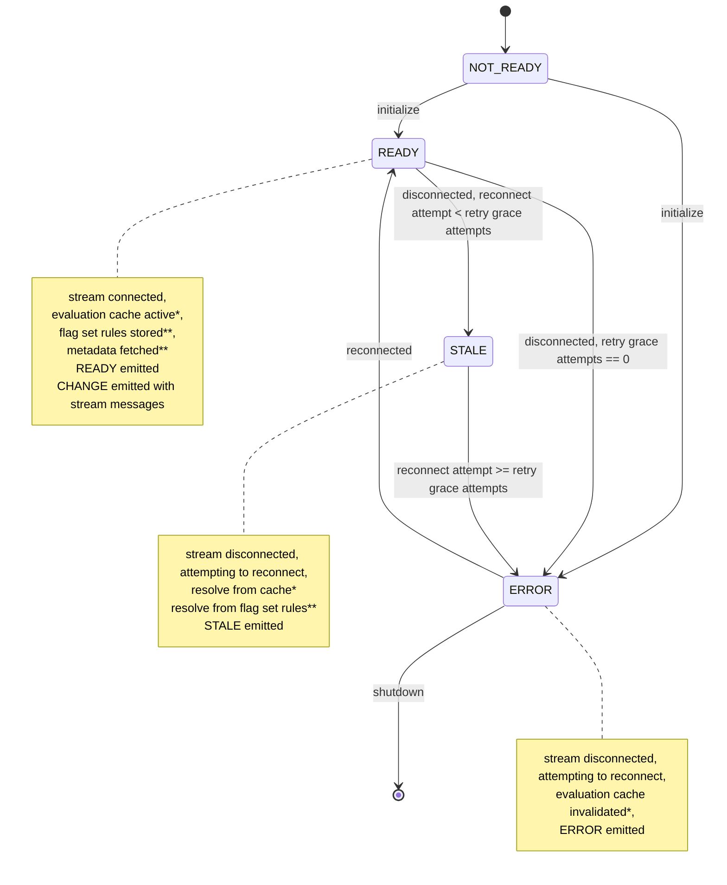

# flagd Providers

!!! note

    This document serves as both a specification and general documentation for flagd providers.
    For language-specific details, see the `README.md` for the provider in question.

flagd providers are as essential as the flagd daemon itself, acting as the "bridge" between the OpenFeature SDK and flagd.
In fact, flagd providers may be the most crucial part of the flagd framework, as they can be used without an active flagd instance.
This document outlines their behavior and configuration.

## In-Process vs RPC Evaluation

There are two modes of operation (`resolvers`) for flagd providers; _in-process_ and _RPC_.
Both modes have their advantages and disadvantages.
For more information on the architectural implications of these different modes, see the [RPC vs In-Process Evaluation](/architecture/#rpc-vs-in-process-evaluation) page.

## Configuration

### Configuration options

Most options can be defined in the constructor, or as environment variables, with constructor options having the highest
precedence.

Below are the supported configuration parameters (note that not all apply to both resolver modes):

| Option name        | Environment variable name  | Explanation                                                                     | Type & Values            | Default                       | Compatible resolver |
| ------------------ | -------------------------- | ------------------------------------------------------------------------------- | ------------------------ | ----------------------------- | ------------------- |
| resolver           | FLAGD_RESOLVER             | mode of operation                                                               | String - `rpc`, `in-process` | rpc                           | rpc & in-process    |
| host               | FLAGD_HOST                 | remote host                                                                     | String                   | localhost                     | rpc & in-process    |
| port               | FLAGD_PORT                 | remote port                                                                     | int                      | 8013 (rpc), 8015 (in-process) | rpc & in-process    |
| targetUri          | FLAGD_GRPC_TARGET          | alternative to host/port, supporting custom name resolution                     | string                   | null                          | rpc & in-process    |
| tls                | FLAGD_TLS                  | connection encryption                                                           | boolean                  | false                         | rpc & in-process    |
| socketPath         | FLAGD_SOCKET_PATH          | alternative to host port, unix socket                                           | String                   | null                          | rpc & in-process    |
| certPath           | FLAGD_SERVER_CERT_PATH     | tls cert path                                                                   | String                   | null                          | rpc & in-process    |
| deadline           | FLAGD_DEADLINE_MS          | deadline for unary calls, and timeout for initialization                        | int                      | 500                           | rpc & in-process    |
| streamDeadlineMs   | FLAGD_STREAM_DEADLINE_MS   | deadline for streaming calls, useful as an application-layer keepalive          | int                      | 600000                        | rpc & in-process    |
| retryBackoffMs     | FLAGD_RETRY_BACKOFF_MS     | initial backoff for stream retry                                                | int                      | 1000                          | rpc & in-process    |
| retryBackoffMaxMs  | FLAGD_RETRY_BACKOFF_MAX_MS | maximum backoff for stream retry                                                | int                      | 120000                        | rpc & in-process    |
| retryGraceAttempts | FLAGD_RETRY_GRACE_ATTEMPTS | amount of stream retry attempts before provider moves from STALE to ERROR state | int                      | 5                             | rpc & in-process    |
| keepAliveTime      | FLAGD_KEEP_ALIVE_TIME_MS   | http 2 keepalive                                                                | long                     | 0                             | rpc & in-process    |
| cache              | FLAGD_CACHE                | enable cache of static flags                                                    | String - `lru`, `disabled`   | lru                           | rpc                 |
| maxCacheSize       | FLAGD_MAX_CACHE_SIZE       | max size of static flag cache                                                   | int                      | 1000                          | rpc                 |
| selector           | FLAGD_SOURCE_SELECTOR      | selects a single sync source to retrieve flags from only that source            | string                   | null                          | in-process          |
| contextEnricher    | -                          | sync-metadata to evaluation context mapping function                            | string                   | identity function             | rpc & in-process    |

### Custom Name Resolution

Some implementations support [gRPC custom name resolution](https://grpc.io/docs/guides/custom-name-resolution/), and abstractions to introduce additional resolvers.
Specifically, a custom resolver for `envoy` has been implemented in some providers, which overrides the authority header with the authority specified in the envoy URL scheme.
Below is an example of a custom target string which will use envoy sidecar proxy for name resolution:

```text
envoy://localhost:9211/flagd-sync.service
```

The custom name resolver provider in this case will use the endpoint name i.e. `flagd-sync.service` as [authority](https://github.com/grpc/grpc-java/blob/master/examples/src/main/java/io/grpc/examples/nameresolve/ExampleNameResolver.java#L55-L61)
and connect to `localhost:9211`.

## flagd Provider Lifecycle

flagd providers are built to adhere to the [provider lifecycle](https://openfeature.dev/specification/sections/flag-evaluation/#17-provider-lifecycle-management) defined in the OpenFeature specification.
Understanding the flagd provider lifecycle is helpful in configuring and optimizing your flagd deployment, and critical to implementing a flagd provider.

The lifecycle is summarized below:

- on initialization, attempt to connect the appropriate stream according to the resolver type (sync stream for in-process vs event stream for RPC) and in the case of in-process, fetch the sync-metadata
    - if stream connection succeeds within the time specified by `deadline`, return from initialization (SDK will emit `PROVIDER_READY`) and for in-process providers, store the `flag set` rules
    - if stream connection fails or exceeds the time specified by `deadline`, abort initialization (SDK will emit `PROVIDER_ERROR`), and attempt to [reconnect](#stream-reconnection)
- while connected:
    - flags are resolved according to resolver mode; either by calling evaluation RPCs, or by evaluating the stored `flag set` rules
    - for RPC providers, flags resolved with `reason=STATIC` are [cached](#flag-evaluation-caching)  
    - if flags change the associated stream (event or sync) indicates flags have changed, flush cache, or update `flag set` rules respectively and emit `PROVIDER_CONFIGURATION_CHANGED`
- if stream disconnects:
    - [reconnect](#stream-reconnection) with exponential backoff
        - if reconnect attempt > `retryGraceAttempts`
            - emit `PROVIDER_ERROR`
            - RPC mode resolves `STALE` from cache where possible
            - in-process mode resolves `STALE` from stored `flag set` rules
        - if reconnect attempt <= `retryGraceAttempts`
            - emit `PROVIDER_STALE`
            - RPC mode resolves `STALE` from cache where possible
            - in-process mode resolves `STALE` from stored `flag set` rules
- on stream reconnection:
    - emit `PROVIDER_READY` and `PROVIDER_CONFIGURATION_CHANGED`
    - in-process providers store the latest `flag set` rules
- emit `PROVIDER_CONFIGURATION_CHANGED` event and update `flag set` rules when a `configuration_change` message is received on the streaming connection
- on shutdown, close the streaming connection in the`shutdown` function



```pseudo
*   RPC providers only
**  In-Process providers only
```

### Stream Reconnection

When either stream (sync or event) disconnects, whether due to the associated deadline being exceeded, network error or any other cause, the provider attempts to re-establish the stream immediately, and then retries with an exponential back-off.
When disconnected, if the number of reconnect attempts is less than `retryGraceAttempts`, the provider emits `STALE`.
While the provider is in state `STALE` the provider resolves values from its cache or stored flag set rules, depending on its resolver mode.
When the number of reconnect attempts is equal to or greater than `retryGraceAttempts`, the provider emits `ERROR`.
The provider attempts to reconnect indefinitely, with a maximum interval of `retryBackoffMaxMs`.

## RPC Providers

RPC providers use the [evaluation protocol](./protos.md#flagdevaluationv1evaluationproto) to connect to flagd, initiate the [event stream](./protos.md#eventstreamresponse), listen for changes in the flag definitions, and evaluate flags remotely by calling flagd.
RPC providers are relatively simple to implement since they essentially call a remote flagd instance with relevant parameters, and then flagd responds with the resolved flag value.
Of course, this means there's latency associated with RPC providers, though this is mitigated somewhat by [caching](#flag-evaluation-caching).

### Flag Evaluation Caching

In RPC mode, `flagd` uses a caching mechanism which greatly reduces latency for static flags (flags without targeting rules).
Evaluations for flags with targeting rules are never cached.

!!! note

    Evaluation caching is only relevant to when the RPC resolver is used; the in-process resolver stores a complete set of rules for a `flag set`, which means evaluation can be done locally, with low latency.

#### Cacheable flags

`flagd` sets the `reason` of a flag evaluation as `STATIC` when no targeting rules are configured for the flag.
A client can safely store the result of a static evaluation in its cache indefinitely (until the configuration of the flag changes, see [cache invalidation](#cache-invalidation)).

Put simply in pseudocode:

```pseudo
if reason == "STATIC" {
    isFlagCacheable = true
}
```

#### Cache invalidation

`flagd` emits events to the server-to-client stream, among these is the `configuration_change` event.
The structure of this event is as such:

```json
{
    "type": "delete", // ENUM:["delete","write","update"]
    "source": "/flag-configuration.json", // the source of the flag configuration
    "flagKey": "foo"
}
```

A client should invalidate the cache of any flag found in a `configuration_change` event to prevent stale data.
If the connection drops all cache values must be cleared (any number of events may have been missed).

### Client Side Providers

Client side flagd providers (used in mobile and front-end web applications) have unique security and performance considerations.
These flagd providers only support the RPC resolver mode (so that `flag set` rules, which might contain sensitive information, are never sent to the client).
Instead, these do bulk evaluations of all flags in the `flag set`, and cache the results until they are invalidated.
Bulk evaluations take place when:

- the provider is initialized
- the context is changed
- a change in the definition notifies the provider it should re-evaluate the flags

This pattern is consistent with OpenFeature's [static context paradigm](https://openfeature.dev/specification/glossary#static-context-paradigm).

!!! note

    To support easy integration with mobile and browser use cases, flagd's [evaluation protocol](./protos.md#flagdevaluationv1evaluationproto) is accessible over both gRPC and HTTP

!!! note

    flagd supports the OFREP protocol, meaning client-side OFREP providers can also be used for client-side use-cases.

### RPC Mode Provider Metadata

The provider metadata includes properties returned from the [provider_ready event payload](./protos.md#eventstreamresponse) data.

## In-Process Evaluation

In-process providers use the [sync schema](./protos.md#syncflagsresponse) to connect to flagd, initiate the [sync stream](./protos.md#eventstreamresponse), and download the `flag-set` rules to evaluate them locally.
In-process providers are relatively complex (compared to RPC providers) to implement since they essentially must implement more of flagd's logic to evaluate flags locally.
Local evaluation has the impact of much lower latency and almost no serialization compared to RPC providers.

### JsonLogic Evaluation

An in-process flagd providers provide the feature set offered by [JsonLogic](https://jsonlogic.com) to evaluate flag resolution requests for a given context.

### Custom JsonLogic Evaluators

In addition to the built-in evaluators provided by JsonLogic, the following custom targeting rules are implemented by the provider:

- [Fractional operation](../../reference/custom-operations/fractional-operation.md)
- [Semantic version evaluation](../../reference/custom-operations/semver-operation.md)
- [StartsWith/EndsWith evaluation](../../reference/custom-operations/string-comparison-operation.md)

### Targeting Key

Similar to the flagd daemon, in-process providers map the [targeting-key](https://openfeature.dev/specification/glossary#targeting-key) into a top level property of the context used in rules, with the key `"targetingKey"`.

### `$flagd` Properties in the Evaluation Context

Similar to the flagd daemon, in-process flagd providers add the following properties to the JsonLogic evaluation context so that users can use them in their targeting rules.
Conflicting properties in the context will be overwritten by the values below.

| Property           | Description                                             |
| ------------------ | ------------------------------------------------------- |
| `$flagd.flagKey`   | the identifier for the flag being evaluated             |
| `$flagd.timestamp` | a unix timestamp (in seconds) of the time of evaluation |

### Sync-Metadata Properties in the Evaluation Context

In-process flagd providers also inject any properties returned by the [sync-metadata RPC response](./protos.md#getmetadataresponse) into the context.
This allows for static properties defined in flagd to be added to in-process evaluations.
If only a subset of the sync-metadata response is desired to be injected into the evaluation context, you can define a mapping function with the `contextEnricher` option.

### In-Process Mode Provider Metadata

The provider metadata includes the top-level metadata property in the [flag definition](../flag-definitions.md).
