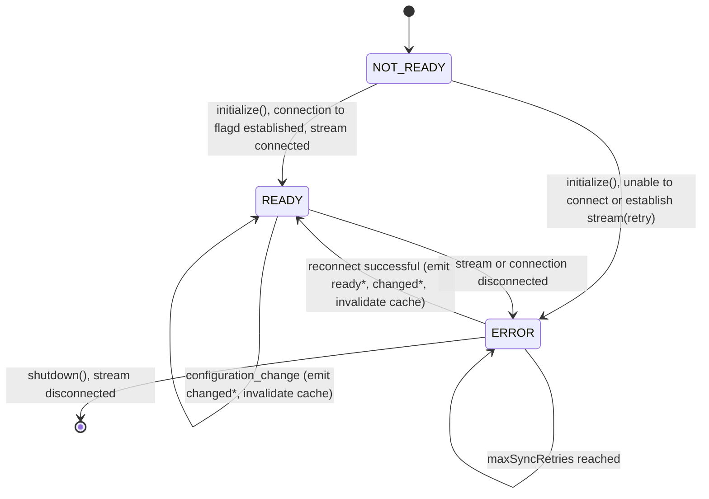
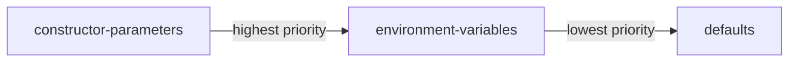

# Creating an RPC flagd provider

By default, **flagd** is a remote service that is accessed via **grpc** by a client application to retrieve feature flags.
Depending on the environment, flagd therefore is usually deployed as a standalone service, e.g. as a Kubernetes Deployment,
or injected as a sidecar container into the pod running the client application,
as it is done in the [OpenFeature Operator](https://github.com/open-feature/open-feature-operator).

Prerequisites:

- Understanding of [general provider concepts](https://openfeature.dev/docs/reference/concepts/provider/)
- Proficiency in the chosen programming language (check the language isn't already covered by the [existing providers](../providers.md))

## flagd Evaluation API

Fundamentally, RPC providers use the [evaluation schema](./protos.md#schemav1schemaproto) to connect to flagd, initiate evaluation RPCs, and listen for changes in the flag definitions.
In order to do this, you must generate the gRPC primitives (message types and client) using the protobuf code generation mechanisms available in your language.
If you are unable to use gRPC code generation, you can also use REST (via the [connect protocol](https://buf.build/blog/connect-a-better-grpc)) to communicate with flagd, though in this case, you will not be able to open a stream to listen for changes.

### Protobuf

Protobuf schemas define the contract between the flagd evaluation API and a client.

#### Code generation for gRPC sync

Leverage the [buf CLI](https://docs.buf.build/installation) or protoc to generate a `flagd-proxy` client in the chosen technology:

Add the [open-feature schema repository](https://github.com/open-feature/schemas) as a submodule

```shell
git submodule add --force https://github.com/open-feature/schemas.git
```

Create a `buf.gen.{chosen language}.yaml` for the chosen language in `schemas/protobuf` (if it doesn't already exist) using one of the other files as a template (find a plugin for the chosen language [here](https://buf.build/protocolbuffers/plugins)) and create a pull request with this file.

Generate the code (this step ought to be automated in the build process for the chosen technology so that the generated code is never committed)

```shell
cd schemas/protobuf
buf generate --template buf.gen.{chosen language}.yaml
```

As an alternative to buf, use the .proto file directly along with whatever protoc-related tools or plugins available for your language.

Move the generated code (following convention for the chosen language) and add its location to .gitignore

Note that for the in-process provider only the `schema` package will be relevant, since RPC providers communicate directly to flagd.

## Provider lifecycle, initialization and shutdown

With the release of the v0.6.0 spec, OpenFeature now outlines a lifecycle for in-process flagd provider initialization and shutdown.

In-process flagd providers should do the following to make use of OpenFeature v0.6.0 features:

- start in a `NOT_READY` state
- fetch the flag definition specified in the sync provider sources and set `state` to `READY` or `ERROR` in the `initialization` function
  - note that the SDK will automatically emit `PROVIDER_READY`/`PROVIDER_ERROR` according to the termination of the `initialization` function
- throw an exception or terminate abnormally if a connection cannot be established during `initialization`
- For gRPC based sources (i.e. flagd-proxy), attempt to restore the streaming connection to flagd-proxy (if the connection cannot be established or is broken):
  - If flag definition have been retrieved previously, go into `STALE` state to indicate that flag resolution responses are based on potentially outdated Flag definition.
  - reconnection should be attempted with an exponential back-off, with a max-delay of `maxSyncRetryInterval` (see [configuration](#configuration))
  - reconnection should be attempted up to `maxSyncRetryDelay` times (see [configuration](#configuration))
  - `PROVIDER_READY` and `PROVIDER_CONFIGURATION_CHANGED` should be emitted, in that order, after successful reconnection
- For Kubernetes sync sources, retry to retrieve the FlagConfiguration resource, using an exponential back-off strategy, with a max-delay of `maxSyncRetryInterval` (see [configuration](#configuration))
- emit `PROVIDER_CONFIGURATION_CHANGED` event and update ruleset when a `configuration_change` message is received on the streaming connection
- close the streaming connection in the`shutdown` function



\* ready=`PROVIDER_READY`, changed=`PROVIDER_CONFIGURATION_CHANGED`, stale=`PROVIDER_STALE`, error=`PROVIDER_ERROR`

## Caching

`flagd` has a caching strategy implementable by RPC providers that support server-to-client streaming.

### Cacheable flags

`flagd` sets the `reason` of a flag evaluation as `STATIC` when no targeting rules are configured for the flag.
A client can safely store the result of a static evaluation in its cache indefinitely (until the configuration of the flag changes, see [cache invalidation](#cache-invalidation)).

Put simply in pseudocode:

```pseudo
if reason == "STATIC" {
    isFlagCacheable = true
}
```

### Cache invalidation

`flagd` emits events to the server-to-client stream, among these is the `configuration_change` event.
The structure of this event is as such:

```json
{
    "type": "delete", // ENUM:["delete","write","update"]
    "source": "/flag-configuration.json", // the source of the flag configuration
    "flagKey": "foo"
}
```

A client should invalidate the cache of any flag found in a `configuration_change` event to prevent stale data.
If the connection drops all cache values must be cleared (any number of events may have been missed).

## Configuration

Expose means to configure the provider aligned with the following priority system (highest to lowest).



### Explicit declaration

This takes the form of parameters to the provider's constructor, it has the highest priority.

### Environment variables

Read environment variables with sensible defaults (before applying the values explicitly declared to the constructor).

| Option name           | Environment variable name      | Type & Values          | Default   |
|-----------------------|--------------------------------|------------------------|-----------|
| host                  | FLAGD_HOST                     | String                 | localhost |
| port                  | FLAGD_PORT                     | int                    | 8013      |
| tls                   | FLAGD_TLS                      | boolean                | false     |
| socketPath            | FLAGD_SOCKET_PATH              | String                 | null      |
| certPath              | FLAGD_SERVER_CERT_PATH         | String                 | null      |
| deadline              | FLAGD_DEADLINE_MS              | int                    | 500       |
| cache                 | FLAGD_CACHE                    | String - lru, disabled | lru       |
| maxCacheSize          | FLAGD_MAX_CACHE_SIZE           | int                    | 1000      |
| maxEventStreamRetries | FLAGD_MAX_EVENT_STREAM_RETRIES | int                    | 5         |
| retryBackoffMs        | FLAGD_RETRY_BACKOFF_MS         | int                    | 1000      |

## Error handling

Handle flag evaluation errors by using the error constructors exported by the SDK (e.g. `openfeature.NewProviderNotReadyResolutionError(ConnectionError)`), thereby allowing the SDK to parse and handle the error appropriately.

## Post creation

The following steps will extend the reach of the newly created provider to other developers of the chosen technology.

### Open an issue to document the provider

Create an issue in openfeature.dev [here](https://github.com/open-feature/openfeature.dev/issues/new?assignees=&labels=provider&template=document-provider.yaml&title=%5BProvider%5D%3A+).
This will ensure the provider is added to OpenFeature's website.
