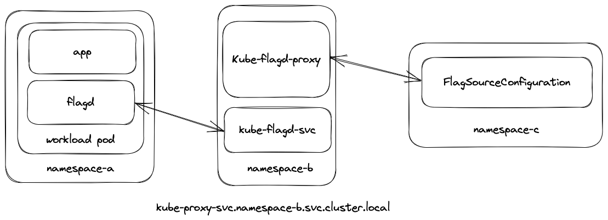

# Kube Flagd Proxy  

[](http://github.com/badges/stability-badges)

The kube flagd proxy acts as a pub sub for deployed flagd sidecar containers to subscribe to change events in FeatureFlagConfiguration CRs.
<!-- markdownlint-disable MD033 -->
<p align="center">
    
</p>
<!-- markdownlint-enable MD033 -->
On request, the flagd-kube-proxy will spawn a goroutine to watch the CR using the `core` package kubernetes sync. Each further request for the same resource will add a new new stream to the broadcast list. Once all streams have been closed, and there are no longer any listeners for a given resource, the sync will be closed.  

The kube-flagd-proxy API follows the flagd grpc spec, found in the [buf schema registry](https://buf.build/open-feature/flagd), as such the existing grpc sync can be used to subscribe to the the CR changes.

## Deployment

The proxy can be deployed to any namespace, provided that the associated service account has been added to the `flagd-kubernetes-sync` cluster role binding. A sample deployment can be found in `/config/deployments/kube-flagd-proxy` requiring the namespace `kube-proxy` to be deployed.

```sh
kubectl create namespace kube-proxy
kubectl apply -f ./config/deployments/kube-flagd-proxy
```

Once the kube-proxy has been deployed any flagd instance subscribe to flag changes using the grpc sync, providing the target resource uri using the `selector` configuration field.
<!-- x-release-please-start-version -->
```yaml
apiVersion: v1
kind: Pod
metadata:
  name: flagd
spec:
  containers:
  - name: flagd
    image: ghcr.io/open-feature/flagd:v0.4.4
    ports:
    - containerPort: 8013
    args:
    - start
    - --sources
    - '[{"uri":"grpc://kube-proxy-svc.kube-proxy.svc.cluster.local:8015","provider":"grpc","selector":"core.openfeature.dev/NAMESPACE/NAME"}]'
    - --debug
---
apiVersion: core.openfeature.dev/v1alpha2
kind: FeatureFlagConfiguration
metadata:
  name: end-to-end
spec:
  featureFlagSpec:
    flags:
      color:
        state: ENABLED
        variants:
          red: CC0000
          green: 00CC00
          blue: 0000CC
          yellow: yellow
        defaultVariant: yellow
```
<!-- x-release-please-end -->
Once deployed, the client flagd instance will be receiving almost instant flag configuration change events.
