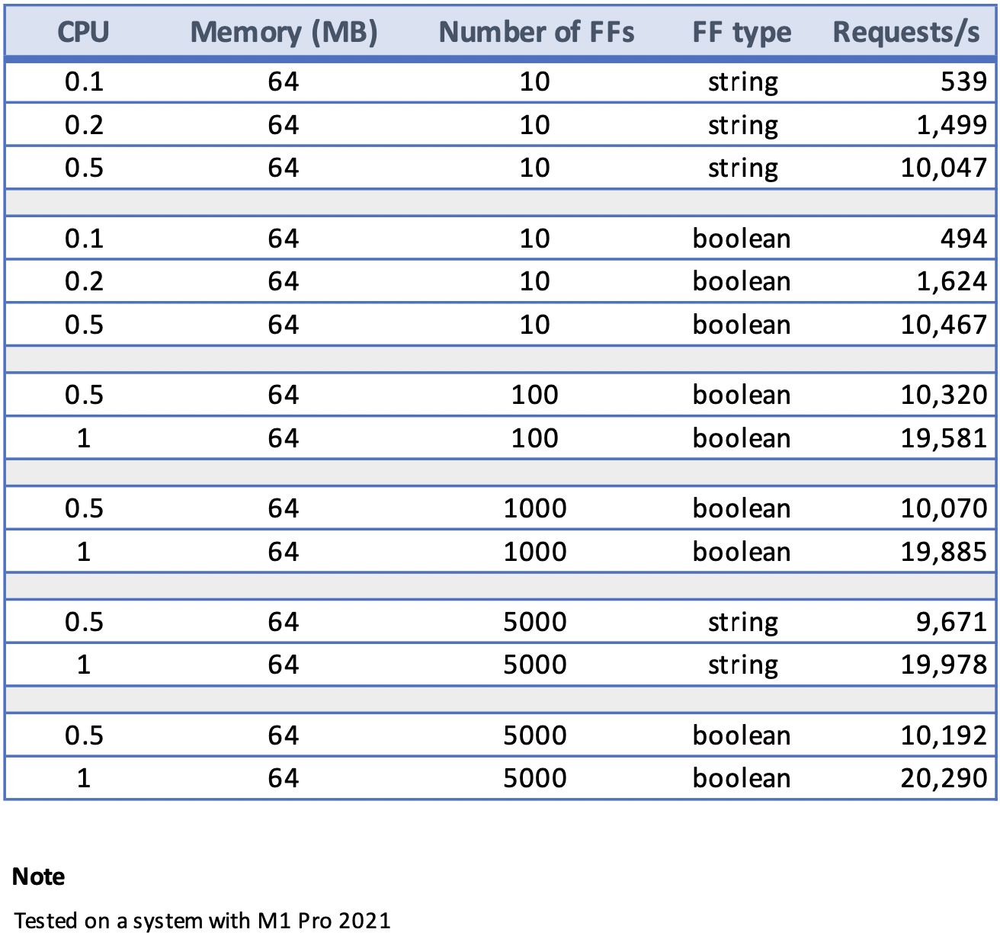

## Load Testing

This folder contains resources for flagd load testing. 

- ff_gen.go : simple, random feature flag generation utility.
- sample_k6.js : sample K6 load test script

### Profiling

It's possible to utilize `profiler.go` included with flagd source to profile flagd during
load test. Profiling is enabled through [go pprof package](https://pkg.go.dev/net/http/pprof).

To enable pprof profiling, build docker image with build argument `GOBUILD` set to `profile`

ex:- `docker build --build-arg GOBUILD=profile . -t flagdprofile`

This image now exposes port `6060` for pprof data. 

### Performance observations

flagd performs well under heavy loads. Consider the following  results,

flagd is able to serve ~20K requests/second with just 64MB memory and 1 CPU. And the impact of flag type
is minimal. There was no memory pressure observed throughout the test runs.

#### Note on observations

Above observations were made on a single system. Hence, throughput does not account for network delays.
Also, there were no background syncs or context evaluations performed.

