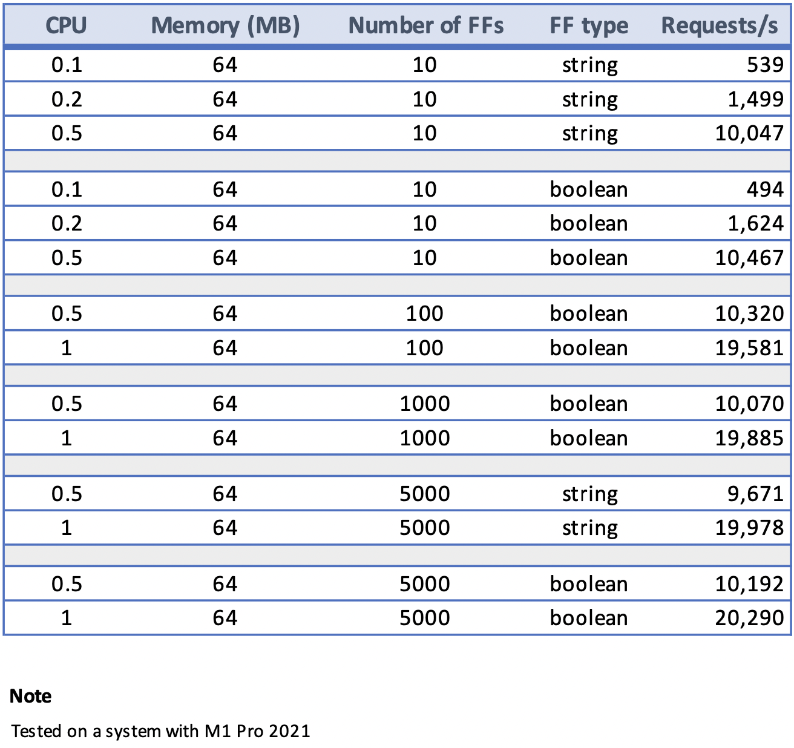

## Load Testing

This folder contains resources for flagd load testing. 

- ff_gen.go : simple, random feature flag generation utility.
- sample_k6.js : sample K6 load test script

### Profiling

It's possible to utilize `profiler.go` included with flagd source to profile flagd during
load test. Profiling is enabled through [go pprof package](https://pkg.go.dev/net/http/pprof).

To enable pprof profiling, build a docker image with the `profile.Dockerfile`

ex:- `docker build . -f ./flagd/profile.Dockerfile -t flagdprofile`

This image now exposes port `6060` for pprof data.

### Example test run

First, let's create random feature flags using `ff_gen.go` utility. To generate 100 boolean feature flags,
run the command

`go run ff_gen.go -c 100 -t boolean`

This command generates `random.json`in the same directory.

Then, let's start pprof profiler enabled flagd docker container with newly generated feature flags.

`docker run -p 8013:8013 -p 6060:6060 --rm -it -v $(pwd):/etc/flagd flagdprofile start --uri file:./etc/flagd/random.json`

Finally, you can run the K6 test script to load test the flagd container.

`k6 run sample_k6.js`

To observe the pprof date, you can either visit [http://localhost:6060/debug/pprof/](http://localhost:6060/debug/pprof/)
or use go pprof tool. Example tool usages are given below,  

- Analyze heap in command line: `go tool pprof http://localhost:6060/debug/pprof/heap`
- Analyze heap in UI mode: `go tool pprof --http=:9090  http://localhost:6060/debug/pprof/heap`

### Performance observations

flagd performs well under heavy loads. Consider the following results observed against the HTTP API of flagd,

flagd is able to serve ~20K HTTP requests/second with just 64MB memory and 1 CPU. And the impact of flag type
is minimal. There was no memory pressure observed throughout the test runs.

#### Note on observations

Above observations were made on a single system. Hence, throughput does not account for network delays.
Also, there were no background syncs or context evaluations performed.

