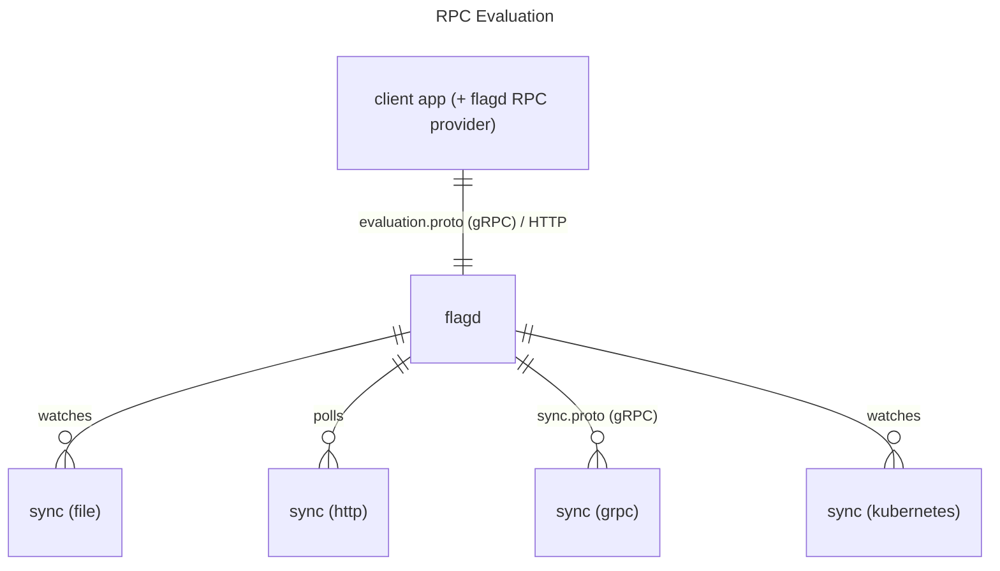
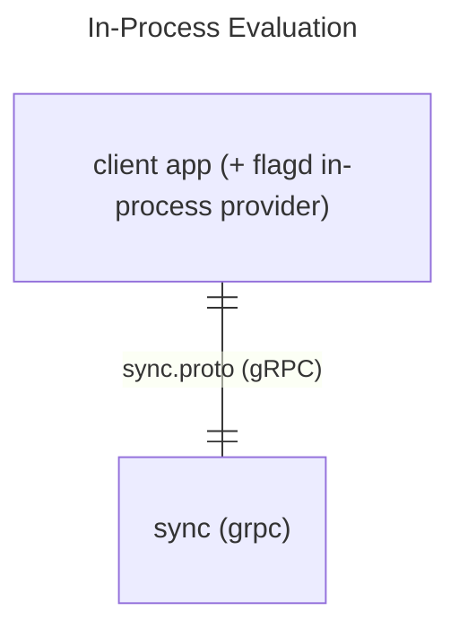

# Architecture

flagd architectures fall into two broad categories: those where the evaluation engine is deployed in a standalone process to which the client application connects ([RPC](#rpc-evaluation)), and those where the evaluation engine is embedded into the client application ([in-process](#in-process-evaluation)).

## RPC vs In-Process Evaluation 

### RPC evaluation

In RPC-based deployments one or more flagd instances deployed and exposed to client applications in your infrastructure.
flagd RPC providers use HTTP or gRPC to request flag evaluations from flagd.
The request payload contains the [flag key](https://openfeature.dev/specification/glossary#flag-key) identifying the flag to be evaluated, as well as the relevant [evaluation context](https://openfeature.dev/specification/glossary#evaluation-context).
The flagd instance is configured to watch one or many [syncs](./concepts/syncs.md), and merges them to build its set of flags (see [here](./concepts/syncs.md#merging) for more details on flag definition merging).
When sync sources are updated, flagd will send notifications to clients that flags have changed, enabling applications to react to changes by re-evaluating flags.

This architecture is can be leveraged by very simple clients, since no in-process engine is needed; in fact, you can evaluate flags directly from a terminal console using the `cURL` utility.
One disadvantage of this pattern is the latency involved in the remote request (though flagd takes ~10ms for an evaluation, and can evaluate thousands of flags per second).

### In-Process evaluation

In-process deployments embed the flagd evaluation engine directly into the client application through the use of an [in-process provider](./deployment.md#in-process).
The in-process provider is connected via the sync protocol to an implementing [gRPC service](./concepts/syncs.md#grpc-sync) that provides the flag definitions.
This pattern requires an in-process implementation of the flagd evaluation engine, but has the benefit of no I/O overhead, since no inter-process communication is required.

<!-- TODO: add link to sync protocol reference entry -->
<!-- TODO: we might want a dedicated Kubernets section here eventually to talk about the specifics of the K8s implementation -->