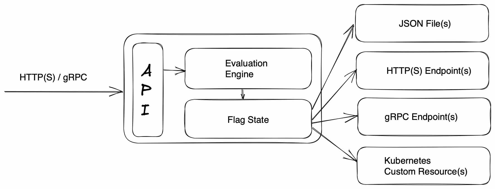

# flagd basics

Your flagd journey will start by defining your feature flags.

flagd will then read those feature flags and make them available to your application.

Your application will interact with flagd via the [OpenFeature SDK](https://openfeature.dev/docs/reference/concepts/evaluation-api) to retrieve flag values via the flagd API.



## Defining feature flags

Flags can be defined in either [JSON](https://github.com/open-feature/flagd/blob/main/samples/example_flags.flagd.json) or [YAML](https://github.com/open-feature/flagd/blob/main/samples/example_flags.flagd.yaml) syntax and the values can be of different types.

Here are two flags, `flagOne` has `boolean` values and `flagTwo` has `string` values.

### flags represented as JSON

```json
{
  "flags": {
    "flagOne": {
      "state": "ENABLED",
      "variants": {
        "on": true,
        "off": false
      },
      "defaultVariant": "on",
      "targeting": {}
    },
    "flagTwo": {
      "state": "ENABLED",
      "variants": {
        "key1": "val1",
        "key2": "val2"
      },
      "defaultVariant": "key1",
      "targeting": {}
    }
  }
}
```

### flags represented as YAML

```yaml
flags:
  flagOne:
    state: ENABLED
    variants:
      'on': true
      'off': false
    defaultVariant: 'on'
    targeting:
  flagTwo:
    state: ENABLED
    variants:
      key1: val1
      key2: val2
    defaultVariant: 'key1'
    targeting:
```

## The structure of a flag

Each flag has:

- A flag key: `flagOne` and `flagTwo` above
- A state: `ENABLED` or `DISABLED`
- One or more possible `variants`. These are the possible values that a flag key can take.
- An optional `targeting` rule (explained below)

## Targeting rules

Imagine you are introducing a new feature. You create a flag with two possible variants: `on` and `off`. You want to safely roll out the feature.
Therefore the flags `defaultValue` is set to `off` for all users.

In other words, the new feature is disabled by default.

Now imagine you want to enable the feature, but only when the following is true:

- Logged in users where the user's email ends in `@example.com`

Rather than codifying that in your application, flagd targeting rules can be used. The flag definition below models this behaviour.

When a user logs into your application, your application is responsible for sending the `email` address via OpenFeature's context parameter (see below) and flagd will return the correct flag.
If the email address of the logged in users contains `@example.com` then flagd will return the `on` variant (ie. `true`).
All other users receives the `defaultVariant` of `off` (ie. false).
In this context, "all other users" means:

- Any logged in user whos email does not contain `@example.com`
- Any logged out user

Your application is responsible for sending the `email` address via OpenFeature's context parameter (see below) and flagd will return the correct flag.

```json
{
    "flags": {
        "isFeatureEnabled": {
            "state": "ENABLED",
            "variants": {
                "on": true,
                "off": false
                },
            "defaultVariant": "off",
            "targeting": {
                "if": [{
                    "in": [
                        "@example.com",
                        {
                            "var": ["email"]
                        }]
                },
                "on", null]
            }
         }
    }
}
```

### Pseudo-code of application passing context

```js
// Here, we provide an empty context, hence the flag evaluates to false value which is the defaultVariant
featureAvailable = openFeature.getBooleanValue("isFeatureEnabled", false, {}) // false

// Here, we provide email for the flag evaluation. Still flag evaluates to defaultVariant of false as email does not end with desired domain
featureAvailable = openFeature.getBooleanValue("isFeatureEnabled", false, {"email": "example@gmail.com"}) // false

// Here, the flag is evaluated with targeting rule matching, hence the value of true
featureAvailable = openFeature.getBooleanValue("isFeatureEnabled", false, {"email": "someone@example.com"}) // true
```

## Fractional Evaluation

In some scenarios, it is desirable to use contextual information to segment the user population further and thus return dynamic values.

Look at the `headerColor` flag below. The `defaultVariant` is `red`, but the flag contains a targeting rule, meaning a fractional evaluation occurs when a context is passed and a key of `email` contains the value `@example.com`.

In this case, `25%` of the email addresses will receive `red`, `25%` will receive `blue`, and so on.

```json
{
    "flags": {
        "headerColor": {
            "variants": {
                "red": "#FF0000",
                "blue": "#0000FF",
                "green": "#00FF00",
                "yellow": "#FFFF00"
            },
            "defaultVariant": "red",
            "state": "ENABLED",
            "targeting": {
                "if": [{
                    "emailWithFaas": {
                        "in": ["@faas.com", {
                            "var": ["email"]
                            }]
                    }
                },
                {
                    "fractional": [
                        { "var": "email" },
                        [ "red", 25 ], [ "blue", 25 ], [ "green", 25 ], [ "yellow", 25 ]
                    ]
                }, null
                ]
            }
        }
    }
}
```

### Fractional evaluations are sticky

Fractional evaluations are "sticky" (deterministic) meaning that the same email address will always belong to the same "bucket" and thus always receive the same color.
This is true even if you run multiple flagd instances completely independently.

Note that the first argument to the `fractional` operator is an expression specifying the *bucketing value*.
This value is used as input to the bucketing algorithm to ensure a deterministic result.
This argument can be omitted, in which case a concatenation of the `targetingKey` and the `flagKey` will be used as the bucketing value.

See this page for more information on [flagd fractional evaluation logic](https://github.com/open-feature/flagd/blob/main/docs/configuration/fractional_evaluation.md).

### Migrating from legacy fractionalEvaluation

If you are using a legacy fractional evaluation (`fractionalEvaluation`), it's recommended you migrate to `fractional`.
The new `fractional` evaluator supports nested properties and json-logic expressions.
To migrate, simply use a json-logic variable declaration for the bucketing property, instead of a string:

old:

```json
"fractionalEvaluation": [
    "email",
    [ "red", 25 ], [ "blue", 25 ], [ "green", 25 ], [ "yellow", 25 ]
]
```

new:

```json
"fractional": [
    { "var": "email" },
    [ "red", 25 ], [ "blue", 25 ], [ "green", 25 ], [ "yellow", 25 ]
]
```

## Other target specifiers

The example above shows the `in` keyword being used, but flagd is also compatible with:

- [starts_with](https://github.com/open-feature/flagd/blob/main/docs/configuration/string_comparison_evaluation.md#startswith-evaluation-configuration)
- [ends_with](https://github.com/open-feature/flagd/blob/main/docs/configuration/string_comparison_evaluation.md#endswith-evaluation-configuration)
- [sem_ver comparisons](https://github.com/open-feature/flagd/blob/main/docs/configuration/sem_ver_evaluation.md)

## flagd OpenTelemetry

flagd is fully compatible with OpenTelemetry:

- flagd exposes metrics at `http://localhost:8014/metrics`
- flagd can export metrics and traces to an OpenTelemetry collector.

See the [flagd OpenTelemetry](opentelemetry.md) page for more information.
